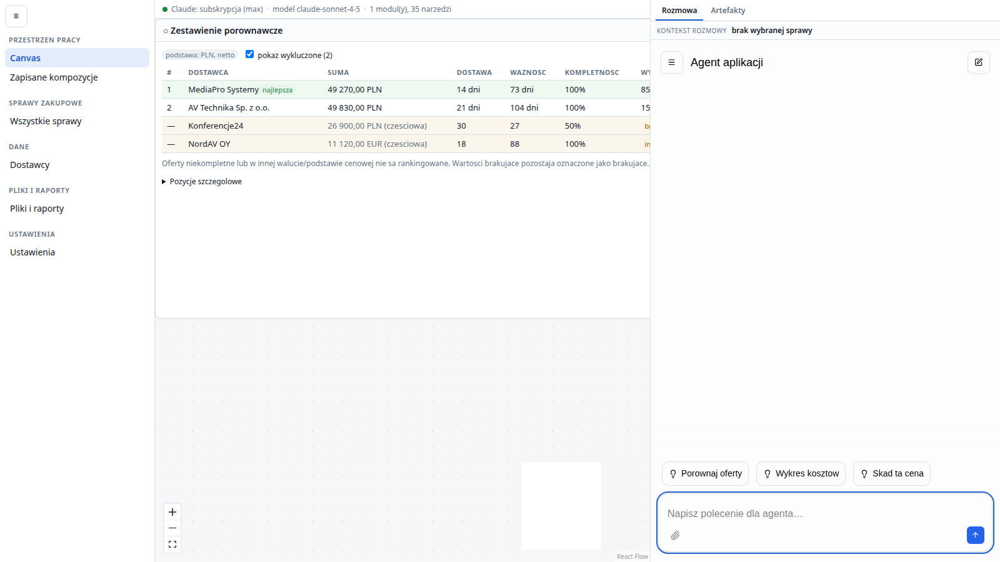

# agentic-app-template

Szablon lokalnej aplikacji webowej, w której pracujesz jednocześnie w zwykłym interfejsie i w
rozmowie z agentem Claude. Agent widzi, co masz otwarte, czyta i zmienia dane przez te same reguły co
interfejs, układa widoki na canvasie, analizuje dołączone pliki i przenosi Cię do właściwego ekranu.

Repozytorium zawiera działającą aplikację przykładową — porównywanie ofert zakupowych — zbudowaną na
platformie, którą można wykorzystać ponownie dla innej dziedziny.

> **Wersja robocza.** Aplikacja uruchamia się i działa, ale nie realizuje jeszcze całej specyfikacji,
> według której powstaje. Czego brakuje, opisuje sekcja [Czego jeszcze nie ma](#czego-jeszcze-nie-ma),
> a szczegółowy stan i plan prac są w [`docs/ACCEPTANCE.md`](docs/ACCEPTANCE.md) i
> [`docs/BACKLOG.md`](docs/BACKLOG.md).



## Spis treści

- [Dla kogo jest ten szablon](#dla-kogo-jest-ten-szablon)
- [Co można zrobić w aplikacji przykładowej](#co-można-zrobić-w-aplikacji-przykładowej)
- [Jak to jest zbudowane](#jak-to-jest-zbudowane)
- [Co się dzieje, gdy wydajesz polecenie](#co-się-dzieje-gdy-wydajesz-polecenie)
- [Technologie i dlaczego te](#technologie-i-dlaczego-te)
- [Uruchomienie](#uruchomienie)
- [Własna aplikacja na tym szablonie](#własna-aplikacja-na-tym-szablonie)
- [Czego jeszcze nie ma](#czego-jeszcze-nie-ma)
- [Przewodnik po dokumentacji](#przewodnik-po-dokumentacji)

## Dla kogo jest ten szablon

- **Dla programistów**, którzy chcą zbudować lokalną aplikację z agentem osadzonym w produkcie — z
  czatem, historią rozmów, artefaktami, plikami i sterowaniem interfejsem — i nie chcą pisać tego od
  zera dla każdej nowej dziedziny.
- **Dla agentów programistycznych** (np. Claude Code) prowadzących dalsze prace w repozytorium. Mają
  własny punkt wejścia z zasadami: [`AGENTS.md`](AGENTS.md).
- **Dla osób oceniających ten zestaw technologii** — repozytorium pokazuje, jak łączą się ze sobą
  OpenUI, AG-UI, Mastra, Claude Agent SDK i MCP w jednej aplikacji, łącznie z miejscami, w których
  trzeba było dopisać własne adaptery.

Aplikacja jest przeznaczona do pracy lokalnej, na jednym komputerze. Nie jest usługą wieloużytkownikową
ani gotowym produktem SaaS.

## Co można zrobić w aplikacji przykładowej

Po pierwszym uruchomieniu aplikacja ma przykładowe dane: sprawę zakupową `PC-2026-01` z czterema
ofertami, plikami źródłowymi i gotową przestrzenią na canvasie. Dane są syntetyczne i generuje je kod
modułu.

- **Przeglądać i porównywać oferty.** Zestawienie liczy backend według reguł dziedziny: oferta
  niekompletna albo w innej walucie nie wygrywa, nawet jeśli jest najtańsza. Da się też prześledzić,
  z którego wiersza pliku źródłowego pochodzi cena.
- **Rozmawiać z agentem o tym, co widzisz.** Polecenia typu „porównaj oferty i pokaż tabelę” albo
  „dodaj wykres kosztów” zmieniają kompozycję canvasu, a „zmień ilość tej pozycji na 3” zmienia dane
  przez te same reguły, które obowiązują w formularzu.
- **Dołączać pliki do rozmowy.** Obrazy PNG/JPEG, skoroszyty XLSX, pliki CSV i tekst. Agent czyta
  treść obrazu, a skoroszyt przetwarza kodem uruchamianym w sandboxie — dopiero po Twojej zgodzie.
  Zmieniony plik zapisuje jako nową wersję; oryginał zostaje bez zmian.
- **Zostawić agenta przy pracy.** Przełączenie rozmowy, zamknięcie panelu czy odświeżenie strony nie
  przerywa zadania. Zatrzymanie jest osobną, jawną akcją.
- **Poprosić o przejście do ekranu.** „Przełącz na pliki” albo „pokaż ustawienie logowania” otwiera
  widok i podświetla element. Pytanie o dane, które mają swój ekran — np. „co jest w dostawcach?” —
  też przenosi na ten ekran.
- **Zawęzić widok rozmową.** „Pokaż tylko dostawców z Polski” zawęża listę na ekranie (nie przepisuje
  jej do czatu). Zawężenie jest w adresie strony, więc przeżywa odświeżenie i działa jako link; pasek
  nad listą mówi, czym widok jest zawężony, i pozwala wrócić do pełnego widoku. Działa tylko w
  widokach, które deklarują pola do zawężania.

Szczegóły działania i ich ograniczenia opisuje [`docs/NEW-APPLICATION.md`](docs/NEW-APPLICATION.md), a
to, co zostało faktycznie sprawdzone, [`docs/ACCEPTANCE.md`](docs/ACCEPTANCE.md).

## Jak to jest zbudowane

Repozytorium to jedno monorepo pnpm z trzema częściami, które mają rozdzielone odpowiedzialności:

```text
packages/
  platform-contracts/   wspólne kontrakty (Zod) i interfejs rejestracji modułu
  platform-server/      backend: rozmowy, uruchomienia agenta, MCP, AG-UI, pliki, sandbox, baza
  platform-ui/          powłoka: nawigacja, canvas, gotowy czat, pliki, ustawienia
  module-procurement/   aplikacja przykładowa: porównywanie ofert (serwer i interfejs)
  module-devkit-probe/  minimalny moduł kontrolny — sprawdza, że platforma działa bez przykładu
apps/
  server/               składa backend: platforma + wybrane moduły
  web/                  składa frontend: platforma + ekrany modułów
docs/                   specyfikacja, przewodniki, stan prac i historia
```

- **Platforma** nie wie nic o ofertach ani dostawcach. Zapewnia to, co każda taka aplikacja ma wspólne:
  czat i historię, wykonanie agenta, narzędzia do canvasu, plików i nawigacji, trwałość danych i
  diagnostykę. Pilnuje tego automatyczna kontrola granicy (`pnpm check:boundaries`).
- **Moduł domenowy** wnosi dziedzinę: tabele, reguły, operacje dostępne dla interfejsu i agenta,
  komponenty kart, ekrany, cele nawigacji i dane przykładowe.
- **Warstwa składania** (`apps/`) jest jedynym miejscem, które zna obie strony — tu wybiera się moduły.

Dzięki temu nowa aplikacja to przede wszystkim nowy moduł, a nie przepisana platforma.

## Co się dzieje, gdy wydajesz polecenie

1. Wpisujesz polecenie w panelu rozmowy. Frontend dołącza do niego kontekst: aktywną rozmowę,
   przestrzeń canvasu, otwarty rekord, zaznaczenie i niezapisane szkice formularzy.
2. Backend (Hono) zapisuje uruchomienie i przekazuje je Mastrze, która uruchamia agenta przez Claude
   Agent SDK — na subskrypcji Claude zalogowanej lokalnie.
3. Agent korzysta z narzędzi MCP: narzędzi platformy (kontekst, canvas, pliki, artefakty, nawigacja,
   zawężanie widoku) i narzędzi modułu. Narzędzia modułu wywołują te same serwisy domenowe co trasy
   HTTP interfejsu, więc walidacja, uprawnienia i zapis w SQLite są w jednym miejscu.
4. Przebieg wraca do przeglądarki jako strumień zdarzeń AG-UI: tekst pojawia się na bieżąco, widać
   wywołania narzędzi i ich wyniki, a zdarzenia o zmianie danych odświeżają karty na canvasie bez
   przeładowania strony.
5. Gdy agent ma przenieść ekran albo go zawęzić, przeglądarka wykonuje to polecenie i odsyła
   potwierdzenie — agent wie, czy to się faktycznie stało.
6. Rozmowa, zdarzenia przebiegu i wyniki narzędzi zostają zapisane w bazie; po odświeżeniu strony albo
   restarcie backendu wracają na swoje miejsce.

Pełny opis architektury i kontraktów: [`docs/ARCHITECTURE.md`](docs/ARCHITECTURE.md).

## Technologie i dlaczego te

| Obszar | Technologia | Dlaczego |
|---|---|---|
| Frontend | React 19, TypeScript 7, Vite | typowane komponenty; lokalna aplikacja po stronie klienta nie potrzebuje renderowania serwerowego |
| Nawigacja i dane | TanStack Router, TanStack Query | stan rozmowy i widoku w adresie (odświeżenie, Wstecz, linki); wspólny cache odświeżany po zmianach |
| Canvas | React Flow | gotowe przesuwanie, powiększanie i geometria kart |
| Czat i dynamiczne widoki | OpenUI Agent Interface, OpenUI Lang + Renderer | gotowy interfejs rozmów zamiast własnego; kompozycje tylko z zarejestrowanego katalogu komponentów |
| Komunikacja z agentem | AG-UI | jeden strumień zdarzeń dla tekstu, narzędzi, błędów i zgód |
| Backend | Node.js, Hono | jeden język z frontendem, długotrwały proces odpowiedni dla sesji agenta i strumieni |
| Agent | Mastra + Claude Agent SDK | prawdziwa pętla agenta Claude z narzędziami, sesjami i sandboxem; wyłącznie na subskrypcji, bez klucza API |
| Narzędzia agenta | MCP, Zod | typowane operacje backendu ze sprawdzanymi schematami |
| Dane | SQLite, Drizzle | lokalna baza bez osobnego serwera, z migracjami |
| Testy | Vitest, Playwright | kontrakty i logika bez modelu; zachowanie w przeglądarce na buildzie produkcyjnym |

## Uruchomienie

### Wymagania

- **Node.js ≥ 22.12** (sprawdzane na 24.19.0) i **pnpm 9.15.9** (np. przez `corepack enable`).
- **Linux.** Aplikacja była uruchamiana tylko na Linuksie (Fedora 44); sandbox Claude Agent SDK zależy
  od mechanizmów systemu, a inne systemy nie były testowane.
- **Konto Claude z subskrypcją**, zalogowane lokalnie w CLI `claude` (polecenie `/login`). Aplikacja
  nie używa klucza API Anthropic. Bez logowania wszystko poza agentem działa — canvas, dane, pliki,
  rozmowy — a polecenia do agenta kończą się czytelnym błędem.
- Do testów przeglądarkowych: Chromium dla Playwright (`pnpm exec playwright install chromium`).

### Pierwszy start

```bash
pnpm install --frozen-lockfile
pnpm build
pnpm start          # http://localhost:8791
```

Przy pierwszym starcie aplikacja tworzy bazę w katalogu `data/` i dodaje dane przykładowe — raz, więc
to, co usuniesz, nie wróci po restarcie. Przydatne warianty:

```bash
PORT=8790 APP_ALLOWED_ORIGINS=http://localhost:8790 pnpm start   # inny port
APP_SKIP_BASE_DATA=1 pnpm start                                   # start bez danych przykładowych
pnpm seed                                                         # dodaj brakujące dane przykładowe
pnpm reset                                                        # UWAGA: kasuje data/ i zaczyna od nowa
```

**Tryb deweloperski** — `pnpm dev` — uruchamia backend na porcie 8791 i Vite na 5173. Proxy Vite
kieruje zapytania zawsze na port 8791, więc jeśli działa tam inna instancja, trafisz do niej.

**Docker** — `docker compose build --no-cache`, potem `docker compose up -d`. Dane są w wolumenie, nie
w obrazie. Poświadczenie Claude nie jest wbudowywane w obraz; żeby agent działał w kontenerze, trzeba
świadomie odkomentować montowanie `~/.claude` w `compose.yaml`.

**Istniejące dane** — nowa wersja uruchomiona na starym katalogu `data/` stosuje zaległe migracje.
Zanim to zrobisz, wykonaj kopię i próbę migracji na kopii:
[`docs/odzyskiwanie-stanu.md`](docs/odzyskiwanie-stanu.md).

### Konfiguracja

| Zmienna | Domyślnie | Znaczenie |
|---|---|---|
| `PORT` | `8791` | port backendu |
| `APP_DATA_DIR` | `<repo>/data` | baza, pliki i katalogi robocze agenta |
| `APP_ALLOWED_ORIGINS` | adresy `localhost` i `127.0.0.1` na portach 5173 i 8791 | dozwolone originy, po przecinku |
| `APP_MODEL` | `claude-sonnet-4-5` | model agenta |
| `APP_RUN_TIMEOUT_MS` | `300000` | limit czasu jednego uruchomienia agenta |
| `APP_MAX_UPLOAD_BYTES` | `8388608` | maksymalny rozmiar pliku |
| `APP_SKIP_BASE_DATA` | — | `1` wyłącza dane przykładowe |

Dostęp do aplikacji chroni lokalna sesja w ciasteczku, niezależna od subskrypcji Claude. Ekran Ustawień
pokazuje plan i termin ważności logowania — w tym celu aplikacja wczytuje plik
`~/.claude/.credentials.json`, zachowuje z niego tylko te dwie informacje, a tokenów nie używa, nie
zapisuje, nie loguje i nie przesyła. Odświeżaniem logowania zajmuje się Claude Agent SDK.

### Sprawdzanie zmian

```bash
pnpm verify          # kontrola granicy, spójność dokumentów oceny, typy, build i testy (bez modelu)
pnpm test:e2e        # testy w przeglądarce na zbudowanej aplikacji; kilka z nich używa prawdziwego modelu
pnpm check:module-swap   # próba podmiany modułu przykładowego na kontrolny, na kopii repozytorium
```

`pnpm test:e2e` działa na istniejącym buildzie, więc uruchamiaj go po `pnpm verify` albo `pnpm build`.
Testy startują własne serwery na portach 8792–8799 z własnymi katalogami danych.

`pnpm acceptance` i `scripts/run-agent.mjs` działają inaczej: łączą się z **działającą** instancją
(domyślnie `http://127.0.0.1:8791`) i zmieniają jej dane. Kieruj je tylko na osobną instancję z
osobnym katalogiem danych, np. przez `APP_BASE=http://127.0.0.1:8790`.

## Własna aplikacja na tym szablonie

1. Utwórz repozytorium z szablonu: przycisk **Use this template** na GitHubie albo
   ```bash
   gh repo create <konto>/<nazwa> --private --template kacperpaczos/agentic-app-template --clone
   ```
2. Dodaj pakiet swojego modułu w `packages/module-<nazwa>`: tabele i migracje, serwisy z regułami,
   narzędzia dla agenta, komponenty kart, ekrany, cele nawigacji i dane przykładowe.
3. Zarejestruj moduł w warstwie składania: `apps/server/src/compose.ts`, `apps/web/src/compose.tsx` i
   `apps/web/src/router.tsx`. Pakietów platformy nie trzeba zmieniać.
4. Odłącz moduł przykładowy — dokładną procedurę (w tym to, której części nie usuwać od razu, bo
   korzystają z niej testy) opisuje przewodnik.
5. Sprawdź całość: `pnpm verify`, potem `pnpm test:e2e`.

Krok po kroku, z opisem kontraktu modułu i znanymi pułapkami:
[`docs/NEW-APPLICATION.md`](docs/NEW-APPLICATION.md). Jeśli pracę prowadzi agent, niech zacznie od
[`AGENTS.md`](AGENTS.md).

## Czego jeszcze nie ma

To wersja robocza. Najważniejsze braki i ograniczenia:

- **Agent nie widzi pełnego stanu ekranu.** Nie odczytuje opisu aktywnego widoku, nie zna zawężenia
  ustawionego wcześniej (dowiaduje się o nim tylko w tej samej turze), nie potrafi wskazać wartości
  konkretnego pola rekordu.
- **Nie ma sortowania ani stronicowania sterowanego rozmową** ani zapisanych preferencji widoków.
  Zawężanie działa na danych już pobranych przez widok.
- **Nie ma przestrzeni „Widoki agenta”**, w której agent sam składa trwałe zestawienia i wykresy.
- **Pliki XLSX:** formuły nie są przeliczane; wykresy, formatowanie warunkowe i tabele przestawne nie
  są zachowywane przy zapisie; pliki `.xlsm` i `.xls` są odrzucane.
- **Zadania w tle** trwają tak długo jak proces backendu; restart oznacza je jako przerwane.
- **Kopia danych** jest ręczna, lokalna i wymaga zatrzymania aplikacji.
- **Eksport telemetrii** (np. Langfuse) nie jest podłączony.
- W wynikach analizy kodu są też znane słabe miejsca w obsłudze współbieżności, idempotencji i zgód —
  opisane razem z resztą otwartych prac w [`docs/BACKLOG.md`](docs/BACKLOG.md).

## Przewodnik po dokumentacji

### Od czego zacząć

- **Chcesz uruchomić i zrozumieć aplikację:** ten plik →
  [`docs/NEW-APPLICATION.md`](docs/NEW-APPLICATION.md) → [`docs/BACKLOG.md`](docs/BACKLOG.md).
- **Budujesz własną aplikację na szablonie:** [`docs/NEW-APPLICATION.md`](docs/NEW-APPLICATION.md) →
  [`AGENTS.md`](AGENTS.md) → odpowiednie rozdziały [`docs/ARCHITECTURE.md`](docs/ARCHITECTURE.md).
- **Prowadzisz dalsze prace nad platformą (człowiek lub agent):** [`AGENTS.md`](AGENTS.md) →
  [`docs/ARCHITECTURE.md`](docs/ARCHITECTURE.md) → [`docs/ACCEPTANCE.md`](docs/ACCEPTANCE.md) →
  [`docs/BACKLOG.md`](docs/BACKLOG.md).

### Dokumenty

| Dokument | Co w nim znajdziesz |
|---|---|
| [`AGENTS.md`](AGENTS.md) | zasady pracy w repozytorium: które dokumenty są ważniejsze, granica platforma–moduł, stos, którego nie zmienia się bez decyzji, jakich dowodów wymaga zmiana |
| [`docs/NEW-APPLICATION.md`](docs/NEW-APPLICATION.md) | jak zrobić inną aplikację: co dostarcza moduł, co zapewnia platforma, pola kontraktu modułu, zawężanie widoków, testy nowej aplikacji, znane pułapki bibliotek |
| [`docs/ARCHITECTURE.md`](docs/ARCHITECTURE.md) | specyfikacja docelowa: architektura, własność danych, kontrakty, przepływy, wymagania dla każdej warstwy i scenariusze prób. Opisuje, jak ma być — nie jak jest |
| [`docs/ACCEPTANCE.md`](docs/ACCEPTANCE.md) | stan realizacji każdego wymagania specyfikacji: co działa, na jakiej podstawie i czego brakuje. Plik generowany |
| [`docs/BACKLOG.md`](docs/BACKLOG.md) | otwarte prace pogrupowane w pakiety, z warunkiem zakończenia każdego pakietu. Plik generowany |
| [`docs/odzyskiwanie-stanu.md`](docs/odzyskiwanie-stanu.md) | kopia bazy razem z plikami, próba migracji na kopii i odtworzenie danych |
| [`docs/observability.md`](docs/observability.md) | co aplikacja zapisuje o przebiegach agenta i jak podłączyć opcjonalny eksport telemetrii |
| [`docs/CONSOLIDATION-UPDATE-2026-09-17.md`](docs/CONSOLIDATION-UPDATE-2026-09-17.md) | ostatnia aktualizacja szablonu: co przeniesiono z aplikacji źródłowej, wyniki testów, publikacja |
| [`docs/CONSOLIDATION-REPORT.md`](docs/CONSOLIDATION-REPORT.md) | jak powstał szablon: wcześniejsze decyzje, testy w czystej instalacji, znalezione wady |
| [`docs/DOCUMENTATION-MAP.md`](docs/DOCUMENTATION-MAP.md) | skąd pochodzi każdy dokument i co stało się ze starszymi materiałami |
| [`FEEDBACK.md`](FEEDBACK.md) | dziennik prac nad szablonem, także nieudane próby i ich przyczyny |
| [`docs/evidence/`](docs/evidence/) | logi i wyniki przebiegów testów, do których odsyłają raporty |
| [`docs/archive/`](docs/archive/) | historia: dokumenty aplikacji źródłowej i nieaktualny plan z wcześniejszej koncepcji |

## Licencja

Repozytorium nie zawiera obecnie pliku licencji.
