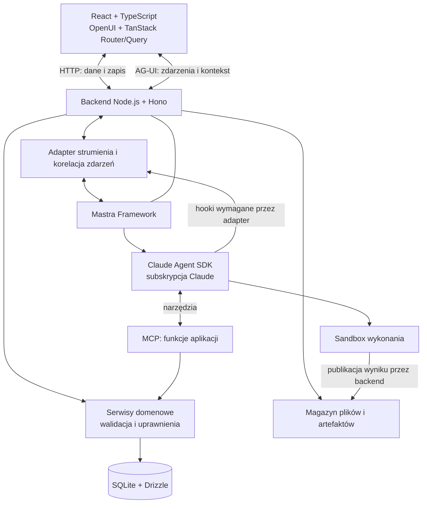

# Projekt techniczny aplikacji agentowej full stack

> **Obowiązująca specyfikacja platformy** (wersja z 2026-09-16: 12 warstw, 200 kryteriów, 27 prób odbiorowych).
> Treść jest wierną kopią zaakceptowanego projektu; jedyna zmiana to usunięcie pustej linii, która rozcinała tabelę prób między T21 i T22.
> Pola odbioru pozostają celowo niezaznaczone. Stan realizacji każdego kryterium: [`ACCEPTANCE.md`](ACCEPTANCE.md) (generowany z tego pliku przez `scripts/acceptance-matrix.mjs`); otwarte prace: [`BACKLOG.md`](BACKLOG.md).
> Poprzednia wersja (95 kryteriów), wobec której oceniano aplikację źródłową: [`archive/agenticapp-2026-09/stack-agentowy-ustalenia-i-materialy-95-kryteriow.md`](archive/agenticapp-2026-09/stack-agentowy-ustalenia-i-materialy-95-kryteriow.md).

## Cel i zakres systemu

System jest lokalną aplikacją webową, w której interfejs, dane biznesowe i agent tworzą jeden produkt. Użytkownik pracuje przez komponenty interfejsu i rozmowę. Agent otrzymuje kontekst bieżącej pracy, wyszukuje dane, uruchamia funkcje backendu, modyfikuje kompozycję interfejsu oraz przetwarza pliki w izolowanym środowisku.

Projekt określa architekturę, technologie, kontrakty integracyjne i wymagania odbiorowe. Jest niezależny od domeny biznesowej. Nie definiuje encji produktu, struktury repozytorium, kolejności prac ani harmonogramu. Kryteria odbioru opisują wynik wdrożenia, a nie zadania wykonawcze.

Zakres obejmuje lokalny frontend i backend, trwałe dane, historię rozmów, artefakty, dynamiczny UI i wykonanie agenta. Claude działa jako usługa zewnętrzna rozliczana w ramach subskrypcji użytkownika. Praca offline, PWA, synchronizacja wielu urządzeń i infrastruktura publicznego SaaS pozostają poza zakresem.

## Status i zastosowanie dokumentu

Dokument stanowi samodzielną specyfikację platformy do budowy lokalnych aplikacji agentowych. Zawiera wymagania, kontrakty i warunki odbioru; nie jest instrukcją kolejności implementacji ani deklaracją, że przyszła aplikacja jest już sprawdzona. Wszystkie pola odbioru są celowo niezaznaczone.

Specyfikacja ma **12 warstw i 200 kryteriów**. Dotychczasowe 95 kryteriów zachowuje identyfikatory Lx.y przypisane według ich kolejności w każdej warstwie; nowe wymagania mają kolejne numery w danej warstwie. Pełny wykaz poniżej jest źródłem prawdy dla macierzy nowego wdrożenia. Nie należy używać starej liczby 95 jako progu zaliczenia.

Do zbudowania konkretnego produktu potrzebny jest dodatkowo jego opis domeny: encje, reguły, operacje, dane przykładowe i oczekiwane rezultaty użytkownika. Nie wymaga to osobnego dokumentu platformowego ani znajomości historii projektu. Pusty folder i ta specyfikacja wystarczają do zaprojektowania infrastruktury, ale nie pozwalają odgadnąć niepodanych zasad biznesowych.

Dwa tryby użycia są rozróżnione:

- **Nowe wdrożenie:** sprawdzenie najnowszych stabilnych React i TypeScript oraz zgodnego zestawu pozostałych zależności; zapis faktycznych wersji i dowodów.
- **Odtworzenie odebranego wdrożenia:** użycie jego lockfile, wersji Node i CLI/SDK, konfiguracji oraz zgodnego schematu danych. Aktualizacja zależności jest zmianą wymagającą regresji, a nie częścią bezwarunkowego odtworzenia.

Odtwarzalność nie oznacza identycznych odpowiedzi modelu. Wymagane są zgodne kontrakty, zachowanie produktu, reguły domenowe i rezultaty odbioru. Dostęp do modelu wymaga działającej subskrypcji użytkownika. Dokładny wygląd i tekst odpowiedzi mogą się różnić.

## Architektura logiczna

AG-UI i MCP pełnią odrębne role. AG-UI przenosi zdarzenia pomiędzy aplikacją a wykonaniem agenta. MCP udostępnia agentowi narzędzia backendu. OpenUI Lang opisuje kompozycję komponentów renderowanych przez React. Żaden z tych mechanizmów nie zastępuje modelu domeny ani trwałego magazynu danych.

## Dobór technologii

| Obszar | Technologia | Uzasadnienie |
|---|---|---|
| Frontend | React i TypeScript, najnowsze stabilne wydania | Typowane komponenty i bezpośrednia zgodność z ekosystemem OpenUI. |
| Budowanie frontendu | Vite | Obsługuje aplikację React działającą po stronie klienta, z osobnym backendem i strumieniowaniem. |
| Nawigacja | TanStack Router | Typowane adresy, parametry i odtwarzanie kontekstu nawigacji. Router wskazuje przestrzeń pracy lub zasób; nie narzuca stałego wnętrza widoku. |
| Dane na froncie | TanStack Query | Współdzielenie pobrań, cache, odświeżanie oraz reakcje na mutacje. |
| Wygląd | Tailwind CSS i komponenty OpenUI | Wspólny styl komponentów produktu oraz wykorzystanie gotowego interfejsu rozmowy. |
| Canvas | React Flow (`@xyflow/react`) | Gotowy pan, zoom i geometria kart; treść kart pozostaje w OpenUI. |
| Dynamiczne UI | OpenUI Lang + Renderer | Kompozycja z kontrolowanego katalogu React. |
| Czat | OpenUI Agent Interface | Gotowa obsługa prezentacji rozmów i artefaktów, uruchamiana z własnym backendem. |
| Backend | Node.js LTS, TypeScript, Hono | Jeden język kontraktów oraz obsługa endpointów i strumieni współpracujących z Mastrą. Długotrwały proces odpowiedni dla sesji SDK i strumieni. |
| Orkiestracja | Mastra Framework | Wspólna obsługa agentów, workflowów, integracji i diagnostyki. |
| Harness | Claude Agent SDK + adapter `@mastra/claude` | Rzeczywista pętla wykonania Claude, sesje, narzędzia i kontrola uprawnień. |
| Dostęp do funkcji | MCP | Typowany i opisany interfejs narzędzi nad serwisami domenowymi. |
| Walidacja kontraktów | Zod | Walidacja danych w runtime i współdzielenie typów TypeScript. |
| Dane trwałe | SQLite + Drizzle ORM | Lokalna relacyjna baza bez osobnego serwera, z transakcjami i migracjami. |
| Pliki | Lokalny magazyn zarządzany przez backend | Trwałe artefakty niezależne od sesji modelu i katalogów tymczasowych. |
| Izolacja | Sandbox Claude SDK; izolacja procesu, gdy wymaga tego środowisko | Ograniczony dostęp do systemu plików i sieci podczas wykonywania kodu. |
| Weryfikacja | Vitest i Playwright | Testy kontraktów i logiki oraz odbiór zachowania w przeglądarce. |
| Telemetria | Mastra i Claude SDK; opcjonalnie Langfuse | Diagnostyka lokalna z możliwością zewnętrznej analizy. |

Backend jest projektowany w TypeScript. Python może służyć do przetwarzania plików wewnątrz sandboxu, ale nie jest drugim obowiązkowym backendem. Vite i Hono odpowiadają wymaganiom lokalnej aplikacji z osobnym serwerem; Next.js nie wnosi tu wymaganej funkcji renderowania serwerowego lub SEO, która uzasadniałaby dodatkową warstwę.

Wersje React i TypeScript mają być najnowszymi stabilnymi wydaniami dostępnymi podczas wdrożenia. Pozostałe pakiety muszą być z nimi zgodne; dokładne wersje utrwala lockfile. Niezgodność zależności jest jawnym problemem integracji, a nie powodem do cichego obniżenia wersji wymaganych technologii. Runtime Node.js pochodzi z aktywnej linii LTS. Nie są wymagane wydania canary ani eksperymentalne.

## Model własności danych

| Rodzaj informacji | Autorytet | Pozostałe reprezentacje |
|---|---|---|
| Dane biznesowe | Serwisy domenowe i baza backendu | Cache klienta i wyniki narzędzi są odczytami/projekcjami. |
| Kompozycja UI | Zapis kompozycji w backendzie | Renderer interpretuje zapis, a agent proponuje jego zmianę. |
| Stan roboczy formularza | Bieżąca interakcja użytkownika, z ustaloną polityką zachowania szkicu | Nie jest zatwierdzoną mutacją danych biznesowych. |
| Rozmowa aplikacji | Backend: właściciel, tytuł, wiadomości/prezentacja, powiązania | OpenUI korzysta z adaptera storage. |
| Sesja wykonania | Claude SDK, z trwałym zapisem i mapowaniem w backendzie | Historia UI nie jest drugą niezależnie edytowaną pamięcią modelu. |
| Artefakt | Backend: metadane, wersje i treść/pliki | Podgląd i pełny widok wskazują ten sam artefakt. |
| Stan zadania | Backend: rejestr wykonania | Czat i telemetryka prezentują stan, ale go nie zastępują. |

Jedno źródło prawdy oznacza jednego właściciela danego rodzaju informacji, a nie wymóg zapisywania wszystkiego w jednej tabeli. Kopie w cache i snapshoty raportów są dopuszczalne, jeżeli ich znaczenie i zasady aktualizacji są jawne.

## Granica platformy, domeny i kompozycji aplikacji

**Platforma** dostarcza powłokę UI, katalog komponentów, rozmowy, sesje, cykl wykonania, adaptery protokołów, magazyn plików i artefaktów, kontrolę zakresów dostępu oraz diagnostykę. Nie zawiera nazw produktów, tabel i reguł konkretnej działalności.

**Moduł domenowy** dostarcza własne encje i migracje, reguły walidacji, autoryzowane serwisy, odczyty i mutacje, narzędzia MCP, komponenty React, odczyty artefaktów live, nawigację i opis kontekstu dla agenta. Funkcje domenowe nie wymagają modelu do obliczenia poprawnego wyniku.

**Kompozycja aplikacji** łączy platformę z wybranymi modułami. To tutaj dopuszczalne są zależności od obu stron. Rejestracja modułu nie wymaga dopisywania jego nazwy w kodzie platformy. Struktura katalogów jest decyzją implementacyjną; kierunek zależności jest wymaganiem.

| Kontrakt rejestracji | Oczekiwany zakres | Właściciel |
|---|---|---|
| Moduł | stabilny identyfikator, wersja, migracje i zależności | kompozycja + moduł |
| Narzędzie | nazwa, opis, schemat wejścia/wyniku, skutek, obsługa błędów, handler serwisu | moduł lub platforma dla operacji wspólnych |
| Komponent | nazwa, schemat właściwości, renderer React, dozwolone powiązania danych | katalog platformy, definicja modułu |
| Odczyt live | identyfikator operacji, wersja kontraktu, parametry, wynik i sprawdzanie dostępu | moduł |
| Nawigacja | nazwa pozycji, trasa/zasób, warunki widoczności | moduł; montaż przez kompozycję |
| Kontekst domenowy | opis zasobu i selektywne odczyty; rozróżnienie zapisu i szkicu | moduł; walidacja przez backend |

Minimalny moduł próbny dowodzi, że platforma nie zależy od domeny demonstracyjnej. Nie dowodzi automatycznie przydatności dla dowolnej przyszłej domeny. Nowy typ wymagania biznesowego może wymagać rozszerzenia kontraktu z zachowaniem zgodności.

## Kontrakty danych i komunikacji

Nazwy poniżej określają znaczenie, nie obowiązkowe nazwy klas lub tabel. Typ TypeScript nie zastępuje walidacji danych wejściowych w runtime.

| Obiekt | Minimalne znaczenie pól i relacji | Niezmiennik |
|---|---|---|
| Rozmowa | identyfikator, właściciel, tytuł, przestrzeń, mapowanie sesji SDK | tytuł nie jest kluczem; właściciel wynika z backendu |
| Wiadomość | identyfikator, rozmowa, rola, kolejność, treść, powiązanie wykonania/narzędzia | przeładowanie nie zmienia tożsamości ani nie wykonuje treści |
| Wykonanie | identyfikator, rozmowa, sesja SDK, kontekst startowy, status, znaczniki czasu, błąd | jeden ostateczny wynik; kolejka nie jest wykonaniem |
| Zdarzenie | wykonanie, numer sekwencji, typ, payload, identyfikatory wiadomości/narzędzia, czas | replay aktualizuje projekcję, nie powtarza skutku domenowego |
| Operacja domenowa | identyfikator operacji, cel, oczekiwana wersja, parametry i wynik | ponowienie tego samego żądania nie powoduje drugiego zapisu |
| Karta | identyfikator, przestrzeń, komponent, właściwości/powiązania, geometria, wersje | geometria i treść nie nadpisują się niezależnymi zapisami |
| Artefakt | identyfikator, właściciel, typ, tryb, wersja, rozmowa, plik/treść lub deskryptor | snapshot jest historyczny; live odczytuje przez autoryzowany serwis |
| Plik | identyfikator, właściciel, nazwa prezentacyjna, typ, rozmiar, checksum, lokalizacja zarządzana | nazwa od użytkownika nie wyznacza dowolnej ścieżki filesystemu |
| Błąd | kategoria, kod, bezpieczny komunikat, korelacja i informacja o ponowieniu | błąd modelu nie jest sukcesem domenowym ani instrukcją płatnego fallbacku |

**Stan wykonania.** Minimalne znaczenia to: zakolejkowane, wykonywane, oczekujące na decyzję, zakończone sukcesem, zakończone błędem, anulowane. Nazwy transportowe mogą być inne. Polityka określa, kiedy anulowanie jest rozstrzygnięte, jak restart oznacza przerwaną pracę i czy ponowienie jest nowym wykonaniem. Jedna zgoda jest powiązana z jednym żądaniem decyzji; stary formularz zgody nie steruje nowym zadaniem.

**Dwa kontrakty historii.** Prezentacja OpenUI i sesja Claude mają odrębne formaty. Ich mapowanie jest jawne. Trwały dziennik zdarzeń może być źródłem projekcji wiadomości, jeżeli projekcja ma deterministyczną kolejność, stabilne identyfikatory i nie jest niezależnie mutowaną kopią prawdy. Edycja wiadomości lub rozgałęzienie wymaga osobnego kontraktu; nie wynika z samej możliwości zmiany tekstu w UI.

**Świeżość danych.** Wynik mutacji wskazuje zmienione zasoby lub zakres unieważnienia. Kontekst właściciela pochodzi z autoryzowanej sesji. Po jego zmianie stare zapytania, opóźnione wyniki i zdarzenia nie mogą publikować danych do nowego zakresu. Cache nie jest granicą bezpieczeństwa: backend nadal autoryzuje każdy odczyt.

**Walidacja.** Nieznane komponenty, niezgodne wersje schematów, nieprawidłowe argumenty i odwołania do niedostępnych zasobów są odrzucane z czytelną przyczyną. Zmiana schematu trwałych danych ma migrację lub jawne zachowanie kompatybilności. Dryf kontraktu między opisem narzędzia, handlerem i rendererem jest defektem produktu.

## Odpowiedzialność integracji bibliotek

Nie zakłada się, że biblioteki automatycznie zapewnią wszystkie połączenia. Każdy adapter ma opisanego producenta i odbiorcę danych, użyte API, zakres własnego kodu i próbę zgodności.

| Połączenie | Wymagany rezultat | Typowa granica do sprawdzenia |
|---|---|---|
| Hono → Mastra → Claude SDK | rzeczywiste wywołanie oficjalnego adaptera, sesja i anulowanie | pakiet w zależnościach nie potwierdza toru wykonania |
| SDK → AG-UI | tekst, narzędzia, błędy, zgody, status i korelacja | tekst w strumieniu Mastry nie dowodzi obecności wyników narzędzi |
| AG-UI → OpenUI | odebrane zdarzenia zmieniają widoczny stan właściwej rozmowy | parser może ignorować część typów; sama poprawna odpowiedź SSE nie wystarcza |
| Storage → OpenUI | pełna historia i artefakty po ponownym wejściu | gotowy adapter rozmów nie musi obejmować artefaktów |
| Router → gotowy czat | dwukierunkowa synchronizacja aktywnej rozmowy i przestrzeni | montaż komponentu w powłoce nie zachowuje sam w sobie stanu po reload |
| Katalog → renderer wiadomości | proza i OpenUI są widoczne we właściwej postaci | GenUI może zmieniać sposób interpretacji całej odpowiedzi |
| SDK → MCP/Zod | narzędzie widoczne, argumenty poprawne, wynik użyteczny | legalny schemat Zod nie gwarantuje obsługi przez konkretny SDK |
| Mastra → eksport telemetrii | rzeczywisty aktywny eksporter i ślad u odbiorcy, gdy włączono eksport | przyjęcie obiektu bez wyjątku nie potwierdza aktywacji |

W niektórych konfiguracjach zaobserwowano brak zdarzeń narzędzi w strumieniu adaptera, problemy schematów `z.record()`/wartości domyślnych, różnice layoutu od mierzonej szerokości kontenera i nieaktywowanie telemetrii przy niezgodnym obiekcie konfiguracji. Są to **przypadki regresyjne do sprawdzenia**, nie uniwersalne twierdzenia o wszystkich przyszłych wersjach. Nie wprowadza się zakazu danej funkcji biblioteki bez sprawdzenia użytej wersji. Dodatkowy pakiet wymagany przez telemetrię musi być wymieniony w konfiguracji opcjonalnej.

## Przepływy funkcjonalne

**Odczyt danych:** komponent lub agent wywołuje funkcję backendu. Backend sprawdza zakres dostępu i pobiera dane. Agent może wyszukiwać i przechodzić po relacjach bez umieszczania całej bazy w kontekście modelu.

**Zmiana danych:** interfejs lub narzędzie MCP wywołuje ten sam serwis domenowy. Serwis waliduje wejście, dostęp i aktualność rekordu, wykonuje transakcję oraz zwraca wynik i informację o zmienionych zasobach. Frontend odświeża odpowiadające im zapytania. Powtórzone żądanie nie powiela operacji biznesowej.

**Zmiana interfejsu:** agent tworzy lub modyfikuje kompozycję z katalogu OpenUI. Aplikacja sprawdza schemat, dozwolone komponenty i odwołania do danych. Renderer pokazuje zaakceptowaną kompozycję, zachowując istotny stan interakcji.

**Przetworzenie pliku:** backend przyjmuje plik, udostępnia go w workspace wykonania i uruchamia agenta w sandboxie. Wynik jest rejestrowany jako artefakt, zapisywany trwale i dostępny do pobrania z aplikacji.

**Kontynuacja rozmowy:** backend odtwarza prezentację rozmowy i powiązaną sesję Claude. Wznowienie nie dokleja ponownie już zapisanych wiadomości i nie odtwarza skutków zakończonych mutacji.

## Interakcja agenta z aplikacją i praca w tle

Agent ma nie tylko odczytywać dane i tworzyć karty, ale również pomagać użytkownikowi poruszać się po aplikacji. Polecenie „pokaż ustawienie” oznacza otwarcie odpowiedniego widoku i wskazanie konkretnej kontrolki; opis słowny nie zastępuje rezultatu w interfejsie. Moduły rejestrują semantyczne cele nawigacji: widoki, przestrzenie, ustawienia, sekcje i elementy. Agent używa typowanych działań na tych celach, bez wykonywania dowolnego JavaScriptu lub odgadywania selektorów DOM. Otworzenie ustawienia nie oznacza jego zmiany.

Polecenie prezentacyjne jest związane z rozmową, wykonaniem i docelową sesją interfejsu. Klient potwierdza wykonanie albo informuje o braku celu, dostępu lub możliwości pokazania elementu. Ukryte sekcje mogą zostać rozwinięte, element przewinięty i czasowo podświetlony, z zachowaniem dostępności. Nowy widok aktualizuje kontekst kolejnego polecenia i historię nawigacji. Ponowne odebranie tego samego zdarzenia nie powiela wpisu historii ani nie przenosi użytkownika ponownie.

Zadanie należy do backendu i rozmowy, nie do aktualnie zamontowanego panelu. Przełączenie rozmowy lub przestrzeni, zamknięcie panelu, odświeżenie i rozłączenie klienta nie oznaczają Stop. Zadanie działa dalej, dopóki backend jest uruchomiony, a wynik trafia do pierwotnej rozmowy. Jawne Stop anuluje wskazane wykonanie. Nie jest wymagane działanie po zatrzymaniu procesu backendu; taki przypadek podlega kontraktowi restartu i odzyskiwania.

Zadanie w tle nie przejmuje aktywnego widoku innej rozmowy. Wynik lub oczekiwanie na zgodę są sygnalizowane przy właściwej rozmowie; użytkownik może do niej wrócić. Polecenie nawigacyjne wykonane w tle zostaje odłożone lub pokazane jako dostępna akcja, zamiast samoczynnie zmieniać bieżącą przestrzeń. Odłączenie obserwatora strumienia jest rozróżnione od anulowania pracy.

### Semantyczny interfejs i przestrzeń prezentacyjna agenta

Robocze widoki aplikacji są kompozycjami OpenUI z zarejestrowanych komponentów React. Ich implementacja pozostaje w React; model operuje nazwami, schematami, powiązaniami danych i dozwolonymi akcjami katalogu. Powłoka, router i gotowy czat mogą pozostać deterministycznymi komponentami React. Samo zastosowanie renderera OpenUI nie daje agentowi wiedzy o widocznym ekranie: aplikacja udostępnia semantyczny opis aktywnej kompozycji, instancji komponentów, powiązanych rekordów i pól, filtrów, sortowania, zaznaczeń i dostępnych działań. Opis jest wersjonowany i odświeżalny; dane są pobierane selektywnie przez autoryzowane operacje backendu.

Polecenie „pokaż tę wartość” obejmuje odnalezienie rekordu i pola, odczyt wartości z backendu, rozpoznanie widoku, otwarcie właściwej przestrzeni i sekcji oraz wskazanie rzeczywistej wartości. Jeśli filtr lub paginacja ją ukrywa, agent może jawnie dostosować prezentację i przewinąć do celu. Nie zastępuje tego opisem słownym ani nie zmienia danych biznesowych. Niejednoznaczny cel wymaga rozstrzygnięcia, a brak celu lub dostępu daje jawny wynik.

Aplikacja ma osobną, widoczną w nawigacji przestrzeń „Widoki agenta” albo równoważny obszar centralnego canvasu związany z rozmową. Agent sam dobiera tam formę prezentacji do intencji: tabelę, wykres, podsumowanie, porównanie lub ich połączenie. Użytkownik nie musi podawać nazwy komponentu. Swoboda dotyczy kompozycji z katalogu, nie generowania i wykonywania dowolnego kodu. Gdy katalog nie pozwala pokazać wyniku, agent ujawnia ograniczenie.

Wygenerowany widok jest pełnoprawnym, interaktywnym widokiem aplikacji: korzysta z tego samego źródła danych, filtrów i dozwolonych operacji co widoki domyślne. Można go dalej modyfikować rozmową, zapisać i ponownie otworzyć. Aktualizacja backendu odświeża prezentację; nie ma drugiej bazy danych w treści modelu. Działanie z tła nie przełącza samowolnie aktywnej przestrzeni użytkownika.

## Pliki wejściowe, analiza i artefakty wynikowe

Obowiązkowy zakres plików obejmuje obrazy PNG/JPEG, arkusze XLSX i dane CSV oraz zwykły tekst. Interfejs umożliwia dołączenie pliku do rozmowy i wskazanie pliku już znajdującego się w magazynie. Każdy załącznik ma tożsamość, zakres dostępu i powiązanie z poleceniem. Obsługiwane formaty oraz limity są widoczne. Inne formaty mogą być rozszerzeniem; nie deklaruje się obsługi dowolnego pliku bez odpowiedniego parsera.

Przyjęcie pliku do magazynu nie jest dowodem jego analizy. Runtime posiada narzędzia i biblioteki potrzebne do rzeczywistego odczytu obrazów i skoroszytów. Obraz może być analizowany przez udokumentowaną ścieżkę multimodalną lub narzędzie obrazowe/OCR; raportowanie nazwy pliku nie zalicza analizy jego treści. Kod obrabiający pliki działa w sandboxie. Agent nie deklaruje obejrzenia obrazu, jeżeli dostał tylko metadane.

Analiza XLSX uwzględnia arkusze, typy komórek, daty, formuły i brakujące wartości w zakresie zadania. Modyfikacja tworzy nową wersję lub nowy artefakt i zachowuje oryginał. Obsługa formuł określa, czy są zachowywane, czy przeliczane; nieaktualny wynik zapisany w skoroszycie nie jest przedstawiany jako świeże obliczenie. Formatowanie i elementy nieobsługiwane mają opisany zakres zachowania. Makra nie są automatycznie wykonywane.

Artefakt wynikowy ma podgląd odpowiedni do typu, metadane pochodzenia i możliwość pobrania. Obraz może mieć miniaturę i pełny podgląd, arkusz podgląd danych oraz plik XLSX do pobrania. Plik wejściowy i wynik nie są utożsamiane z wiadomością czatu i pozostają dostępne po powrocie do rozmowy oraz restarcie.

## Warstwy systemu i warunki odbioru

Warstwa jest zamknięta, gdy wszystkie jej kryteria są spełnione i mają dowód z działającego systemu lub właściwego testu kontraktu. Punkt zablokowany, pominięty lub potwierdzony wyłącznie dokumentacją pozostawia warstwę otwartą. Kryteria warunkowe odnoszą się tylko do jawnie opisanej funkcji opcjonalnej. Zamknięcie wszystkich warstw wymaga dodatkowo potwierdzenia przepływów między nimi.

### 1. Runtime i środowisko full stack

**Cel:** uruchamialna lokalna aplikacja z trwałym backendem. **Technologie:** Node.js LTS, Hono, Vite, React, TypeScript.

**Odpowiedzialność warstwy.** Lokalny backend jest procesem długotrwałym, a frontend działa również z produkcyjnego buildu. Ustawienia prywatne i uruchomienie SDK należą do serwera. Konfiguracja środowiska odróżnia instancję użytkownika od instancji testowej; sama nazwa portu nie jest dowodem izolacji. Stan przechowywany przez SDK, bazę domenową i rejestr wykonań ma odrębne, jawne zasady trwałości. Ostrzeżenie biblioteki o magazynie w pamięci wymaga wskazania, czy przechowuje ona jakiekolwiek dane wymagające odtworzenia.

**Kryteria odbioru:**

- [ ] **L1.1** Frontend i backend uruchamiają się z udokumentowanej konfiguracji na docelowym systemie.
- [ ] **L1.2** React i TypeScript są najnowszymi stabilnymi wersjami; lockfile i zgodność zależności są sprawdzone.
- [ ] **L1.3** Build produkcyjny oraz sprawdzanie typów kończą się bez błędów; działanie nie zależy od serwera developerskiego Vite.
- [ ] **L1.4** Backend obsługuje zwykłe żądania i strumienie bez buforowania odpowiedzi do końca generacji.
- [ ] **L1.5** Konfiguracja prywatna nie trafia do pakietu frontendu ani odpowiedzi HTTP.
- [ ] **L1.6** Restart zachowuje trwałe dane; zatrzymanie aplikacji nie pozostawia niezarządzanych procesów roboczych.
- [ ] **L1.7** Dostęp lokalny ma jawne zasady origin i autoryzacji; token subskrypcji nie pełni roli tokena dostępu do aplikacji.
- [ ] **L1.8** Instancja testowa ma odrębny katalog danych, adres i identyfikację; konfiguracja kierująca test na instancję użytkownika jest odrzucana przed operacją zapisu.
- [ ] **L1.9** Przygotowanie bazy testowej kończy się przed jej otwarciem przez serwer; żaden setup nie usuwa bazy pod działającym procesem.
- [ ] **L1.10** Sprzątanie testów dotyczy wyłącznie procesów i zasobów danego przebiegu; nie stosuje szerokiego dopasowania nazw procesów użytkownika.
- [ ] **L1.11** Izolacja ścieżek uwzględnia rzeczywisty cel katalogu i dowiązania; testy nie usuwają danych wskazanych poza swoim zakresem.
- [ ] **L1.12** Wersje rozwiązanych pakietów, Node, SDK i zewnętrznego CLI oraz stan kodu są zapisane razem z dowodami; lockfile nie jest jedynym źródłem wersji CLI.
- [ ] **L1.13** Czyste uruchomienie z instrukcji i lockfile odtwarza aplikację bez nieudokumentowanych plików poprzedniej instalacji.

Źródła: [Vite](https://vite.dev/guide/), [adapter Hono dla Mastry](https://mastra.ai/reference/server/hono-adapter), [Node.js LTS](https://github.com/nodejs/Release), [React](https://react.dev/versions), [TypeScript](https://www.typescriptlang.org/download/).

### 2. Komponenty i nawigacja frontendowa

**Cel:** spójny i dostępny interfejs z elementów wielokrotnego użytku. **Technologie:** React, TypeScript, TanStack Router, Tailwind CSS.

**Odpowiedzialność warstwy.** Powłoka zawiera zwijaną lewą nawigację, centralny infinite canvas i prawy czat. Gotowa biblioteka canvasu, referencyjnie React Flow, odpowiada za pan, zoom, przesuwanie i rozmiar kart. React nadal implementuje komponenty; OpenUI opisuje ich dozwoloną kompozycję. Nie jest wymagane przepisywanie implementacji każdego komponentu na język OpenUI ani generowanie kodu tras przez model.

Aktywna rozmowa i przestrzeń są odtwarzalnym kontekstem nawigacji. Adres URL może zawierać ich identyfikatory, a przejścia między trasami zachowują je zgodnie z kontraktem. Synchronizacja adresu i stanu czatu respektuje zarówno wybór użytkownika w czacie, jak i Wstecz/Dalej. Wolniejszy odczyt poprzedniej rozmowy nie może nadpisać przestrzeni wybranej później.

**Kryteria odbioru:**

- [ ] **L2.1** Komponenty domenowe mają typowane właściwości i są zarejestrowane w katalogu OpenUI.
- [ ] **L2.2** Domyślna kompozycja obejmuje lewą nawigację i prawy czat, z adaptacją do mniejszych ekranów.
- [ ] **L2.3** Nawigacja, odświeżenie oraz Wstecz/Dalej przywracają właściwą aktywną rozmowę i przestrzeń pracy bez ręcznego wyszukiwania rozmowy na liście.
- [ ] **L2.4** Dynamiczne wnętrze UI nie wymaga generowania nowych plików tras ani wykonywalnego kodu aplikacji.
- [ ] **L2.5** Formularze i podstawowe interakcje działają z klawiatury, mają etykiety i widoczny fokus.
- [ ] **L2.6** Ładowanie, brak danych, błąd i brak dostępu mają rozróżnialne stany prezentacji.
- [ ] **L2.7** Po przeładowaniu wracają ta sama aktywna rozmowa i przestrzeń bez ręcznego otwierania szuflady; następne polecenie trafia do właściwej rozmowy.
- [ ] **L2.8** Wybór rozmowy, zmiana przestrzeni, przejścia przez linki i Wstecz/Dalej zachowują spójny kontekst; stara odpowiedź sieciowa nie cofa nowszego wyboru.
- [ ] **L2.9** Szufladę rozmów można otworzyć i zamknąć na szerokim i wąskim panelu; canvas ani overflow nie przechwytują jej interakcji.
- [ ] **L2.10** Układ jest sprawdzony przy rzeczywistej szerokości kontenera; zagnieżdżony provider lub nadpisanie CSS nie jest traktowane jako dowód konfiguracji.
- [ ] **L2.11** Usunięta lub niedostępna rozmowa i błąd pobrania mają czytelny stan zastępczy; cudze tytuły i wiadomości nie są ujawniane.
- [ ] **L2.12** Pan, zoom, przesunięcie i zmiana rozmiaru kart działają na gotowej bibliotece canvasu i nie przerywają czatu ani interakcji formularza.
- [ ] **L2.13** Polecenie agenta otwiera wskazany widok, ustawienie lub przestrzeń i pokazuje właściwy element, zamiast tylko opisywać drogę do niego.
- [ ] **L2.14** Element docelowy może być odsłonięty, przewinięty i czasowo podświetlony; brak celu lub dostępu daje czytelny rezultat, bez zmiany wartości ustawienia.
- [ ] **L2.15** Nawigacja zlecona przez agenta zachowuje historię Wstecz/Dalej i aktualizuje kontekst; ponowienie zdarzenia nie powiela nawigacji.
- [ ] **L2.16** Polecenie „pokaż wartość pola tego rekordu” otwiera właściwy widok i przestrzeń, ujawnia rekord mimo filtra lub paginacji i wskazuje pole z wartością zgodną z backendem; potwierdzenie klienta identyfikuje rekord i pole.
- [ ] **L2.17** Agent ustawia i usuwa filtry oraz zmienia sortowanie przez typowane akcje. Wynik jest widoczny w kontrolkach i zbiorze wyników, trafia do kontekstu agenta i nie modyfikuje danych biznesowych.

Źródła: [TanStack Router](https://tanstack.com/router/latest), [Tailwind z Vite](https://tailwindcss.com/docs/installation/using-vite), [katalog OpenUI](https://www.openui.com/docs/openui-lang/defining-components).

### 3. Dynamiczna kompozycja interfejsu

**Cel:** pełna robocza kompozycja UI modyfikowana przez agenta w kontrolowanych granicach. **Technologie:** OpenUI Lang i Renderer.

**Odpowiedzialność warstwy.** Katalog określa nazwy komponentów, schematy właściwości i powiązania z odczytami backendu. Stabilny identyfikator karty oznacza jej tożsamość; wersja oznacza zmianę jej stanu. Zmiana wartości nie nadaje automatycznie nowej tożsamości. Geometria karty i jej treść mają odrębne zasady aktualizacji, tak aby przeciągnięcie nie nadpisywało odpowiedzi agenta.

Jeżeli trwały opis kompozycji jest własnym typowanym drzewem, integracja opisuje jego jednoznaczne odwzorowanie na OpenUI Lang/Renderer. Nie wolno nazywać dowolnego JSON-a OpenUI bez takiego odwzorowania. Warstwa nie dopuszcza wykonywania dowolnego kodu modelu jako kodu aplikacji.

**Kryteria odbioru:**

- [ ] **L3.1** Początkowy układ i układ zmieniony przez agenta korzystają z tego samego katalogu komponentów.
- [ ] **L3.2** Agent może dodać, usunąć, przestawić i zmienić właściwości elementu przez obsługiwany opis kompozycji.
- [ ] **L3.3** Nieznany komponent, nieprawidłowe właściwości i niedozwolone odwołania nie są wykonywane ani zatwierdzane.
- [ ] **L3.4** Częściowa lub błędna odpowiedź modelu nie niszczy ostatniego poprawnego układu.
- [ ] **L3.5** Zmiana kompozycji zachowuje zaznaczenia, filtry i niezapisane dane albo jawnie rozwiązuje konflikt przed ich utratą.
- [ ] **L3.6** Zapisana kompozycja jest odtwarzana po ponownym otwarciu aplikacji.
- [ ] **L3.7** Dane biznesowe wyświetlane przez komponenty pochodzą z backendu; wygenerowane wartości nie zastępują trwałych rekordów.
- [ ] **L3.8** Tożsamość karty pozostaje stabilna przy zmianie danych; wersja geometrii i wersja treści nie nadpisują się wzajemnie.
- [ ] **L3.9** Równoczesne przesunięcie użytkownika i zmiana treści przez agenta zachowują oba poprawne rezultaty albo ujawniają rozstrzygalny konflikt.
- [ ] **L3.10** Cztery operacje kompozycji — dodanie, aktualizacja, przesunięcie i usunięcie — mają dowód rzeczywistego wywołania przez agenta, nie tylko test endpointu.
- [ ] **L3.11** Zwykły tekst, poprawny OpenUI, częściowy OpenUI i błędny opis są rozróżniane; rejestracja katalogu nie powoduje niewidocznych odpowiedzi.
- [ ] **L3.12** Wygenerowany opis używa wyłącznie zarejestrowanych komponentów i odczytów; własna reprezentacja ma udokumentowane odwzorowanie na renderer.
- [ ] **L3.13** Wynik próby dynamicznego UI jest nowym lub zmienionym obiektem powiązanym z badanym wykonaniem; zastany element nie zalicza próby.
- [ ] **L3.14** Widoki domyślne i „Widoki agenta” używają rzeczywistych kompozycji OpenUI i wspólnego katalogu React; próba obejmuje więcej niż pojedynczy statyczny komponent osadzony w czacie.
- [ ] **L3.15** Osobna przestrzeń prezentacji agenta jest dostępna z nawigacji, powiązana z rozmową i zachowuje wygenerowane kompozycje po przełączeniu rozmowy oraz przeładowaniu.
- [ ] **L3.16** Na pytanie wymagające zestawienia agent bez wskazania nazwy komponentu tworzy adekwatną prezentację danych; osobne polecenie wykresu daje rzeczywisty wykres z poprawnymi seriami, jednostkami i zakresem.
- [ ] **L3.17** Kolejne polecenie zmienia istniejący widok agenta, np. filtr, grupowanie lub typ prezentacji, zachowując nieobjęte zmianą elementy i stan użytkownika.
- [ ] **L3.18** Wygenerowana tabela lub wykres korzysta z zarejestrowanego odczytu i odświeża się po mutacji backendu; interakcje uruchamiają te same autoryzowane operacje domenowe co widok domyślny.

Źródła: [komponenty](https://www.openui.com/docs/openui-lang/defining-components), [edycja przyrostowa](https://www.openui.com/docs/openui-lang/incremental-editing), [zapytania i mutacje](https://www.openui.com/docs/openui-lang/queries-mutations).

### 4. Czat i zarządzanie rozmowami

**Cel:** gotowy interfejs rozmów bez implementowania kolejnego własnego chatbota. **Technologie:** OpenUI Agent Interface, adapter storage backendu.

**Odpowiedzialność warstwy.** Agent Interface dostarcza listę rozmów, kompozytor, prezentację wiadomości i obszar artefaktów. Backend dostarcza trwałe kontrakty storage. Rozszerzenia publicznymi hookami, slotami i adapterami są dopuszczalne; nie oznaczają budowy nowego czatu. Wymiana fragmentu renderera wymaga zachowania narzędzi, błędów, artefaktów, formatowania i dostępności.

Wiadomość asystenta może zawierać tekst, OpenUI, wywołania narzędzi lub ich kombinację. Zwykła proza nie może zniknąć po zarejestrowaniu biblioteki OpenUI. Historia przechowuje albo odtwarza powiązane wywołania i wyniki narzędzi, a nie tylko końcowe zdanie. Odtworzenie prezentacji nie jest ponownym wykonaniem narzędzia.

**Kryteria odbioru:**

- [ ] **L4.1** Czat korzysta z gotowego komponentu OpenUI, bez obowiązkowej zewnętrznej płatnej usługi.
- [ ] **L4.2** Użytkownik tworzy rozmowę, widzi ją na liście, przełącza się między rozmowami i usuwa wybraną rozmowę.
- [ ] **L4.3** Rozmowy mają automatyczne sensowne tytuły oraz możliwość zmiany tytułu; mechanizm nie korzysta z API Anthropic.
- [ ] **L4.4** Historia i tytuły wracają po odświeżeniu oraz restarcie backendu.
- [ ] **L4.5** Przełączenie rozmowy nie miesza wiadomości, kontekstu ani wyników trwających wykonań.
- [ ] **L4.6** Powtórzenie żądania lub reconnect nie tworzy podwójnych wiadomości.
- [ ] **L4.7** Usunięcie ma określony skutek dla sesji, aktywnego zadania i artefaktów; aplikacja nie pozostawia niespójnych powiązań.
- [ ] **L4.8** Zakres gotowej obsługi edycji wiadomości, rozgałęziania i przywracania usuniętych rozmów jest opisany jako dostępny lub niedostępny; UI nie sugeruje niezaimplementowanych funkcji.
- [ ] **L4.9** Zwykła proza, formatowanie, treść OpenUI i odpowiedź po narzędziu są widoczne w gotowym czacie; test sprawdza treść, a nie pusty kontener.
- [ ] **L4.10** Nadanie identyfikatora nowej rozmowie podczas pierwszej tury nie przemontowuje czatu w sposób gubiący wiadomości lub trwający strumień.
- [ ] **L4.11** Wywołania narzędzi, argumenty w dozwolonym zakresie, wyniki i błędy są widoczne podczas pracy oraz po przeładowaniu i restarcie.
- [ ] **L4.12** Trwała reprezentacja wiąże wywołanie z wynikiem i wiadomością, np. przez toolCalls i toolCallId; same końcowe treści odpowiedzi nie zastępują historii narzędzi.
- [ ] **L4.13** Identyfikatory wiadomości i narzędzi nie kolidują między wykonaniami; projekcja historii zachowuje kolejność i jest idempotentna.
- [ ] **L4.14** Przy odtwarzaniu starej rozmowy brak zdarzeń nie powoduje wymyślania aktywności ani utraty zachowanej odpowiedzi.
- [ ] **L4.15** Rozszerzenie renderera zachowuje prezentację narzędzi i artefaktów; wymaganie gotowego czatu nie blokuje publicznych adapterów potrzebnych do integracji.

Źródło: [OpenUI — backend i storage](https://www.openui.com/docs/agent/reference/self-hosting).

### 5. Komunikacja i zdarzenia

**Cel:** pełna informacja o wykonaniu w UI. **Technologie:** AG-UI, integracja Mastry, adapter strumienia OpenUI.

**Odpowiedzialność warstwy.** AG-UI jest kontraktem komunikacji, a nie nazwą obowiązkowego pakietu. Potwierdzenie zgodności obejmuje strukturę i znaczenie komunikatów, identyfikatory, kolejność, zakończenie i zachowanie klienta. Oficjalne typy, schematy i adaptery są preferowane, o ile obsługują wybrany harness. Most dla brakujących zdarzeń ma wąski zakres i testy.

Strumień tekstu, hooki narzędzi i zdarzenia domeny mogą mieć różne źródła. Jedna warstwa integracji wiąże je z wykonaniem i nadaje spójny porządek prezentacji; nie udaje, że adapter gwarantuje kolejność, której faktycznie nie gwarantuje. Własne zdarzenia rozszerzają protokół w przewidzianym do tego kanale i mają wersjonowany schemat. Podgląd tekstu podczas generacji może być umieszczony poza docelową wiadomością, jeżeli jest czytelny, przypisany do właściwej rozmowy i bez utraty treści przechodzi do historii.

**Kryteria odbioru:**

- [ ] **L5.1** Tekst jest widoczny przyrostowo przed zakończeniem generacji.
- [ ] **L5.2** UI rozpoznaje rozpoczęcie i zakończenie wykonania, błąd oraz anulowanie.
- [ ] **L5.3** Wywołania narzędzi i ich wyniki są powiązane i rzeczywiście widoczne w czacie podczas wykonania oraz po odtworzeniu historii.
- [ ] **L5.4** Dane artefaktów i zmian UI docierają do właściwych rendererów.
- [ ] **L5.5** Pytanie lub prośba o decyzję dociera do interfejsu, a odpowiedź wraca do właściwego wykonania.
- [ ] **L5.6** Rozłączenie i ponowne połączenie nie powielają zdarzeń ani skutków operacji.
- [ ] **L5.7** Każde wykonanie ma jeden rozstrzygający status końcowy; UI nie pozostaje bezterminowo w stanie ładowania po błędzie.
- [ ] **L5.8** Pokrycie zdarzeń zostało sprawdzone z rzeczywistym adapterem Claude, a brakujące mapowania są jawnie opisane.
- [ ] **L5.9** Przyrost tekstu ma co najmniej dwa różne obserwowane stany przed zakończeniem wykonania; treść dopiero po końcu, podpowiedź i echo polecenia nie zaliczają testu.
- [ ] **L5.10** Podgląd strumienia jest związany z rozmową i wykonaniem, a po zakończeniu ustępuje właściwej wiadomości bez utraty lub podwojenia odpowiedzi.
- [ ] **L5.11** Zgodność AG-UI jest sprawdzana dla schematów i zachowania potrzebnych zdarzeń, nie tylko ich nazw lub obecności pakietu.
- [ ] **L5.12** Most między tekstem, hookami SDK i zdarzeniami domeny zachowuje korelację; równoległe przebiegi nie korzystają ze wspólnego zmiennego kontekstu.
- [ ] **L5.13** Kolejność tekst–narzędzie, narzędzie–tekst, wiele narzędzi i brak tekstu prowadzą do poprawnego statusu i prezentacji.
- [ ] **L5.14** Reconnect, zamknięcie strumienia, anulowanie i restart nie tworzą sprzecznych stanów końcowych ani zakleszczenia odczytu.
- [ ] **L5.15** Ograniczenie parsera biblioteki jest potwierdzone dla użytej wersji i obsłużone adapterem lub jawnym niespełnionym wymaganiem; nie ukrywa braku funkcji.
- [ ] **L5.16** Polecenia prezentacyjne mają identyfikator, cel, rozmowę i wykonanie oraz potwierdzenie klienta; wysłanie zdarzenia nie jest uznawane za dowód pokazania elementu.
- [ ] **L5.17** Odłączenie odbiorcy strumienia przy zmianie rozmowy lub reload nie wywołuje anulowania zadania; jawne Stop ma odrębne znaczenie.

Źródła: [Mastra–AG-UI](https://github.com/ag-ui-protocol/ag-ui/tree/main/integrations/mastra/typescript), [OpenUI–Mastra](https://www.openui.com/integrations/mastra).

### 6. Kontekst aplikacji dla agenta

**Cel:** trafne działanie na aktualnie oglądanych danych bez przesyłania całej bazy. **Technologie:** kontrakt kontekstu, Zod, AG-UI i narzędzia odczytu.

**Odpowiedzialność warstwy.** Kontekst jest opisem bieżącej interakcji, nie bazą danych ani dowodem uprawnień. Obejmuje właściciela wynikającego z sesji backendu, rozmowę, przestrzeń, zasób, zaznaczenia, filtry, szkice i wersje istotnych danych. Dane od klienta nie ustanawiają właściciela.

Kontekst początkowy jest odczytywany w chwili wysłania polecenia. Aktualny kontekst podczas długiego zadania wymaga rzeczywistego kanału aktualizacji lub odczytu; narzędzie zwracające wyłącznie snapshot ze startu nie spełnia tego wymagania. Nowe zaznaczenie nie przenosi automatycznie już rozpoczętej mutacji na inny rekord. Operacje wskazują jawny cel i wersję danych.

**Kryteria odbioru:**

- [ ] **L6.1** Kontekst obejmuje aktualną rozmowę, zasób, zaznaczenie, filtry i identyfikację kompozycji.
- [ ] **L6.2** Zmiana wyboru w UI zmienia kontekst kolejnego polecenia.
- [ ] **L6.3** Agent potrafi pobrać aktualny kontekst podczas dłuższego zadania.
- [ ] **L6.4** Kontekst przesłany przez frontend jest walidowany i nie nadaje uprawnień backendowych.
- [ ] **L6.5** Agent odróżnia roboczy stan formularza od danych zapisanych.
- [ ] **L6.6** Polecenie odnoszące się do aktualnego elementu prowadzi do operacji na właściwym rekordzie, co potwierdza wynik backendu.
- [ ] **L6.7** Większe zbiory są pobierane selektywnie z paginacją lub limitem, a nie dołączane w całości do każdego promptu.
- [ ] **L6.8** Kontekst polecenia jest odczytywany w chwili wysłania, a nie utrwalony przy montowaniu komponentu.
- [ ] **L6.9** Próba zmiany zaznaczenia lub szkicu podczas długiego wykonania wykazuje, że agent potrafi odczytać nowszy kontekst, z rozróżnieniem go od kontekstu startowego.
- [ ] **L6.10** Operacja rozpoczęta dla konkretnego rekordu nie zmienia celu na skutek późniejszej nawigacji; aktualność wersji jest sprawdzana przy zapisie.
- [ ] **L6.11** Brak lub nieaktualność zasobu i utrata dostępu są odróżniane od pustego wyniku; agent nie uzupełnia braków wymyślonymi danymi.
- [ ] **L6.12** Przełączenie rozmowy, przestrzeni i właściciela nie pozostawia kontekstu poprzedniego zakresu w następnym poleceniu.
- [ ] **L6.13** Agent może poznać katalog dostępnych widoków i semantycznych celów UI oraz wywołać dozwoloną nawigację i podświetlenie przez typowany kontrakt.
- [ ] **L6.14** Zadanie poprzedniej rozmowy nie przejmuje nowego zaznaczenia ani przestrzeni; prezentacja jego wyniku w aktywnym UI wymaga właściwego kontekstu odbiorcy.
- [ ] **L6.15** Agent może odczytać semantyczny opis aktywnego UI: widok, wersję kompozycji, instancje komponentów, powiązania rekord–pole, aktualne filtry, sortowanie i dozwolone akcje. Katalog komponentów sam w sobie nie zalicza tego kryterium.
- [ ] **L6.16** Istnieje sprawdzalne mapowanie rekord–pole na cel prezentacyjny; niejednoznaczność, brak renderera i brak uprawnień są rozróżniane. Pomyślne wyszukanie wartości nie jest raportowane jako jej pokazanie.
- [ ] **L6.17** Po zmianie filtra lub widoku agent potrafi odczytać potwierdzony nowy stan UI; nie opiera dalszej odpowiedzi wyłącznie na stanie sprzed akcji. Kontekst ma wersję lub znacznik pozwalający wykryć nieaktualność.

Źródła: [Zod](https://zod.dev/), [AG-UI](https://docs.ag-ui.com/).

### 7. Orkiestracja backendowa

**Cel:** wspólne wykonanie agentowe i integracje bez tworzenia własnego silnika od początku. **Technologie:** Mastra Framework, integracja z serwerem Hono.

**Odpowiedzialność warstwy.** Mastra rejestruje i uruchamia adapter Claude SDK; SDK dostarcza pętlę agenta. Warstwa aplikacji wiąże wykonanie z właścicielem, kontekstem, kolejką i trwałymi zdarzeniami. Nie zakłada się, że adapter SDK automatycznie zapewnia pamięć Mastry, pełne zdarzenia narzędzi lub identyfikator sesji.

Jedna sesja Claude nie jest uruchamiana równolegle bez obsługi takiego trybu. Oddzielne rozmowy mogą działać jednocześnie. Kontekst narzędzi jest przypisany do wykonania, np. przez osobną instancję serwera MCP, i nie zależy od globalnego zmiennego „aktualnego użytkownika”. Czas zakolejkowania i rzeczywisty początek wykonania są odrębnymi zdarzeniami.

**Kryteria odbioru:**

- [ ] **L7.1** Claude SDK jest zarejestrowany i wywoływany przez oficjalną integrację Mastry.
- [ ] **L7.2** Żądanie aplikacji jest powiązane z wykonaniem, kontekstem i diagnostyką.
- [ ] **L7.3** Wynik, błąd i anulowanie przechodzą przez warstwę orkiestracji do klienta.
- [ ] **L7.4** Równoległe żądania do tej samej sesji nie powodują niekontrolowanych wyścigów ani mieszania kontekstów.
- [ ] **L7.5** Orkiestracja nie omija serwisów domenowych przy mutacjach.
- [ ] **L7.6** Zakres własnych adapterów i wykorzystanych mechanizmów Mastry jest udokumentowany.
- [ ] **L7.7** Działanie nie wymaga Mastra Factory, dodatkowego harnessu AgentController ani hostingu Mastry.
- [ ] **L7.8** Okna rzeczywistego wykonania dwóch zadań tej samej sesji nie nakładają się; pomiar używa startu wykonania, a nie czasu zakolejkowania.
- [ ] **L7.9** Różne rozmowy mogą działać równolegle bez mieszania narzędzi, odpowiedzi, zgód lub danych właściciela.
- [ ] **L7.10** Błąd i anulowanie zwalniają kolejkę; następne zadanie może osiągnąć poprawny wynik.
- [ ] **L7.11** Narzędzia są dostępne w prawdziwej sesji SDK; niezgodny schemat nie usuwa serwera MCP po cichu bez diagnostyki.
- [ ] **L7.12** Zastosowanie mostu hooków jest uzasadnione brakami rzeczywistego adaptera; nie powstają dwie niezależne pętle agentowe dla tego samego zadania.
- [ ] **L7.13** Brak transkryptu SDK dla zachowanej rozmowy daje jawny wynik odzyskiwania lub błąd; aplikacja nie deklaruje zachowania pamięci, której nie odtworzyła.

Źródła: [SDK agents](https://mastra.ai/docs/connections/sdk-agents), [Hono](https://mastra.ai/reference/server/hono-adapter).

### 8. Harness i uwierzytelnienie Claude

**Cel:** rzeczywisty runtime Claude używający wyłącznie subskrypcji. **Technologie:** Claude Agent SDK, `@mastra/claude`.

**Odpowiedzialność warstwy.** Zainstalowany i zalogowany runtime Claude wykonuje zadania przez oficjalny SDK i adapter Mastry. Dostępność subskrypcji i zasady dostawcy są zależnością zewnętrzną, sprawdzaną dla docelowego wdrożenia. Aplikacja nie zastępuje niedostępnej subskrypcji płatnym API.

Diagnostyka rozdziela sposób logowania, stan lokalnych metadanych i ostatni potwierdzony dostęp. Data wygaśnięcia tokena dostępu nie przesądza o niemożności odświeżenia przez SDK. Aplikacja nie implementuje własnego odświeżania tokenów. Jeżeli odczytuje plik poświadczeń dla metadanych, opisuje to wprost; parsowanie całego pliku oznacza również przejściowy odczyt tokenów do pamięci procesu, nawet jeśli nie są zwracane.

**Kryteria odbioru:**

- [ ] **L8.1** Wykonanie korzysta z pętli i narzędzi Claude SDK, a nie wyłącznie modelu Claude w routerze LLM.
- [ ] **L8.2** Działa uwierzytelnienie subskrypcyjne, z potwierdzeniem trybu bez ujawniania tokena.
- [ ] **L8.3** Klucz API Anthropic, gateway i automatyczny fallback płatnego API nie są aktywną ścieżką wykonania.
- [ ] **L8.4** Narzędzia MCP są dostępne w SDK i prawdziwe wywołanie zwraca wynik do dalszej pracy agenta.
- [ ] **L8.5** Sesja jest kontynuowana przez jej właściwy identyfikator, bez powielania historii.
- [ ] **L8.6** Wygaśnięcie uwierzytelnienia i wyczerpanie limitu dają czytelny błąd oraz zachowują stan pracy.
- [ ] **L8.7** Poświadczenia pozostają poza frontendem, artefaktami i logami.
- [ ] **L8.8** Zgodność konkretnej wersji SDK, adaptera i sposobu logowania została sprawdzona rzeczywistym wywołaniem.
- [ ] **L8.9** Sposób logowania, stan metadanych i ostatni potwierdzony dostęp są odrębnymi informacjami; obecność pliku nie oznacza zdrowego połączenia.
- [ ] **L8.10** Przeterminowany access token nie blokuje automatycznie możliwości odświeżenia przez SDK; skuteczne i odrzucone odświeżenie mają sprawdzone zachowanie.
- [ ] **L8.11** Limit użycia jest odróżniany od odwołanego logowania, błędu sieci i błędu narzędzia; zachowuje historię i nie powoduje automatycznej powtórki mutacji.
- [ ] **L8.12** Kontrolowane błędy uwierzytelnienia i limitu są sprawdzone na granicy adaptera aż do widocznego UI; symulacja nie jest opisana jako rzeczywiste wyczerpanie limitu.
- [ ] **L8.13** Brak sekretów jest sprawdzony w adekwatnych logach, odpowiedziach HTTP, trwałych danych, artefaktach i buildzie frontendu; dwa endpointy nie stanowią dowodu dla wszystkich powierzchni.
- [ ] **L8.14** Opis odczytu poświadczeń jest zgodny z kodem; tokeny nie są kopiowane do raportu lub śladów testów, a testy negatywne nie niszczą logowania użytkownika.

Ścieżkę techniczną uzasadnia przekazywanie opcji SDK przez adapter oraz oficjalny mechanizm tokena subskrypcyjnego Claude. Potwierdzenie dokumentacyjne nie jest jeszcze odbiorem wdrożenia. MiniMax przez klucz API pozostaje osobnym opcjonalnym wariantem; jego działanie nie zalicza tej warstwy.

Źródła: [adapter Claude](https://github.com/mastra-ai/mastra/blob/main/agent-sdks/claude/src/index.ts), [uwierzytelnienie](https://code.claude.com/docs/en/authentication), [subskrypcja i SDK](https://support.claude.com/en/articles/15036540-use-the-claude-agent-sdk-with-your-claude-plan).

### 9. Model domeny i funkcje backendu

**Cel:** jeden autorytet danych i bezpieczne operacje biznesowe. **Technologie:** serwisy TypeScript, Zod, MCP, Drizzle i SQLite.

**Odpowiedzialność warstwy.** Moduł domenowy definiuje encje, reguły, uprawnienia i operacje. HTTP i MCP są wejściami do tych samych serwisów. Narzędzia mają opisy intencji, skutków, parametrów i wyników oraz limity odczytu. Dostęp do surowej bazy nie zastępuje kuratorowanego zestawu funkcji.

Zod i schematy SDK muszą być zgodne w konkretnych wersjach. Sam poprawny typ TypeScript nie potwierdza rejestracji narzędzia w sesji modelu. Deduplikacja operacji jest egzekwowana atomowo po stronie backendu, także gdy wiele żądań o tym samym identyfikatorze dotrze jednocześnie. Klucz deduplikacji jest ograniczony właścicielem i rodzajem operacji.

**Kryteria odbioru:**

- [ ] **L9.1** Encje, relacje i reguły domenowe są opisane dla konkretnego produktu.
- [ ] **L9.2** Endpointy i narzędzia MCP korzystają z tych samych reguł walidacji i mutacji.
- [ ] **L9.3** Wejścia są walidowane w runtime, a błędy mają rozpoznawalne typy i przyczyny.
- [ ] **L9.4** Agent potrafi wyszukać rekord, przejść po wielopoziomowych relacjach i pobrać szczegóły.
- [ ] **L9.5** Uprawnienia sprawdza backend; identyfikator właściciela dostarczony przez model lub przeglądarkę nie wystarcza do uzyskania dostępu.
- [ ] **L9.6** Konflikt aktualności nie nadpisuje nowszych danych bez rozstrzygnięcia.
- [ ] **L9.7** Powtórzenie tej samej operacji nie dubluje skutków biznesowych.
- [ ] **L9.8** Operacja wieloetapowego zapisu jest atomowa albo ma jawny mechanizm odzyskania spójności.
- [ ] **L9.9** Testy potwierdzają rzeczywistą zmianę danych oraz odrzucenie nieuprawnionej operacji.
- [ ] **L9.10** Platforma nie importuje modułu biznesowego; kompozycja aplikacji rejestruje moduły, a ich serwisy są testowalne bez modelu i UI.
- [ ] **L9.11** Moduł rejestruje schematy, narzędzia, odczyty live, komponenty, nawigację i migracje przez jawne kontrakty; brak modułu nie powoduje odwołań do jego tabel.
- [ ] **L9.12** Minimalny drugi moduł o innej nazwie działa bez zmian w platformie; test zależności obejmuje kod i konfigurację, nie tylko nazwy pakietów.
- [ ] **L9.13** Schematy narzędzi przechodzą kontrolę zgodności SDK oraz próbę wykrycia i wywołania; własności opcjonalne i domyślne mają zgodną semantykę w runtime.
- [ ] **L9.14** Jednoczesne ponowienia tej samej operacji powodują dokładnie jeden skutek; ten sam klucz z inną treścią jest odrzucany lub jednoznacznie rozstrzygany.
- [ ] **L9.15** Wymuszona awaria w połowie wieloetapowej mutacji potwierdza atomowość lub odzyskanie; test kopii bazy nie zastępuje tej próby.
- [ ] **L9.16** Narzędzia odczytu i mutacji mają opis skutków i zakresu dostępu; model nie może ominąć reguł przez bezpośredni dostęp do tabel.

Źródła: [MCP w Claude SDK](https://code.claude.com/docs/en/agent-sdk/mcp), [Zod](https://zod.dev/), [Drizzle i SQLite](https://orm.drizzle.team/docs/sqlite/get-started-sqlite).

### 10. Trwałość, cache i artefakty

**Cel:** odtwarzalna praca i aktualny interfejs. **Technologie:** SQLite, Drizzle, TanStack Query, storage i renderery OpenUI, trwałe sesje SDK.

**Odpowiedzialność warstwy.** Cache jest projekcją danych backendu. Jego klucze uwzględniają zakres dostępu, zasób i parametry; zmiana właściciela odcina także stare żądania i strumienie. Po mutacji odświeżany jest wynik widoczny na ekranie, a nie tylko status sieci.

Snapshot przechowuje historyczny wynik. Artefakt live przechowuje typowany deskryptor zarejestrowanego odczytu domenowego, bez kodu lub SQL od modelu. Odczyt ponownie sprawdza dostęp i pobiera aktualne dane. Wersja definicji artefaktu, wersja źródła i wynik odczytu mają rozróżnione znaczenie. Platforma dostarcza mechanizm, moduł rejestruje odczyty; brak live jest brakiem platformy nawet przy jednym konsumencie.

Kopia SQLite obejmuje zatwierdzony stan z WAL oraz pliki. Kopia samego głównego pliku bazy przy niezapisanym checkpointcie nie wystarcza. Migracja i odtwarzanie historii są testowane na kopii. Zakres kopii, przestój, zasady sesji aplikacji i brak lub obecność transkryptów SDK są jawnie opisane.

**Kryteria odbioru:**

- [ ] **L10.1** Własność każdego rodzaju danych odpowiada tabeli modelu własności; nie istnieją niezależnie mutowane kopie domeny.
- [ ] **L10.2** Migracje tworzą i aktualizują bazę bez utraty obsługiwanych danych; sprawdzona jest kopia i odtworzenie trwałego stanu lokalnego.
- [ ] **L10.3** Rozmowa aplikacji jest jednoznacznie powiązana z sesją Claude i jej właścicielem.
- [ ] **L10.4** Restart przywraca historię, kompozycję, powiązania sesji i artefakty.
- [ ] **L10.5** Mutacja przez UI lub MCP odświeża właściwe dane na froncie bez pełnego przeładowania.
- [ ] **L10.6** Komponenty współdzielą pobrania dla tego samego zasobu; klucze cache uwzględniają kontekst dostępu i filtry.
- [ ] **L10.7** Zmiana kontekstu właściciela nie ujawnia danych z poprzedniego cache.
- [ ] **L10.8** Artefakt ma stabilny identyfikator, wersję, właściciela i trwałą treść; tytuł nie jest jego kluczem.
- [ ] **L10.9** Podgląd i pełny widok wskazują tę samą wersję; pliki można pobrać po restarcie.
- [ ] **L10.10** Raport historyczny zachowuje treść, a artefakt oznaczony jako żywy pobiera aktualne dane.
- [ ] **L10.11** Przełączenie właściciela w tej samej instancji klienta usuwa poprzedni cache i odcina opóźnione żądania oraz strumienie; nowe wyniki nie zawierają poprzednich danych.
- [ ] **L10.12** Nieaktualne dane nie są przedstawiane jako świeży wynik po nieudanym odświeżeniu; stan błędu jest widoczny.
- [ ] **L10.13** Deskryptor live wskazuje typowany odczyt modułu, a backend przy każdym odczycie sprawdza uprawnienia; nie zawiera dowolnego SQL ani kodu.
- [ ] **L10.14** Po zmianie źródła snapshot zachowuje treść, a live pokazuje aktualny wynik przy otwarciu i w otwartym widoku; obie ścieżki są sprawdzone po restarcie.
- [ ] **L10.15** Wersja definicji i świeżość wyniku live są rozróżnione; podgląd i pełny widok nie pokazują sprzecznych danych bez oznaczenia.
- [ ] **L10.16** Kopia zachowuje zatwierdzony stan SQLite wraz z WAL oraz powiązane pliki; jest ponownie odczytana i sprawdzona pod względem integralności.
- [ ] **L10.17** Próba migracji na kopii porównuje tożsamość i treść danych, jawnie dopuszczone zmiany oraz drugie uruchomienie bez dodatkowego skutku.
- [ ] **L10.18** Istnieje sprawdzona procedura odtworzenia, określająca zachowanie stanu sprzed próby, zgodność wersji kodu oraz los sesji aplikacji i transkryptów SDK.
- [ ] **L10.19** Kopie i testy migracji nie zmieniają aktywnej bazy użytkownika; gotowość migracji jest odróżniona od jej zastosowania na docelowych danych.

Adapter Claude nie zapewnia automatycznie pamięci Mastry. Zapis rozmów i mapowanie sesji wymagają jawnego rozwiązania; samo podłączenie storage do czatu nie potwierdza poprawnego wznowienia modelu.

Źródła: [sesje SDK](https://code.claude.com/docs/en/agent-sdk/sessions), [storage OpenUI](https://www.openui.com/docs/agent/reference/self-hosting), [artefakty](https://www.openui.com/docs/agent/core-concepts/artifacts), [renderery](https://www.openui.com/docs/agent/guides/custom-artifacts), [TanStack Query](https://tanstack.com/query/latest/docs/framework/react/guides/query-invalidation).

### 11. Pliki, sandbox i cykl życia zadań

**Cel:** rzeczywiste przetwarzanie plików i kontrolowane długie wykonanie. **Technologie:** sandbox Claude SDK, workspace, backendowy rejestr zadań i magazyn plików.

**Odpowiedzialność warstwy.** Workspace jest przestrzenią pracy, sandbox ograniczeniem dostępu, a worktree tylko odseparowanym checkoutem kodu. Żadne z tych pojęć nie zastępuje pozostałych. Ochrona obejmuje narzędzia plikowe, powłokę, sieć i procesy potomne.

Dopuszczenie narzędzia w konfiguracji SDK może ominąć późniejszą bramkę interaktywnej zgody. Macierz uprawnień rozróżnia operacje automatycznie dozwolone, wymagające decyzji i zabronione. Reguły dostępu backendu obowiązują niezależnie od zgody modelowej. Stop oznacza zakończenie wykonania, nie tylko zamknięcie połączenia HTTP lub zmianę ikony. Zerwane połączenie, zamknięty panel i jawne anulowanie mają opisane, odrębne skutki.

**Kryteria odbioru:**

- [ ] **L11.1** Użytkownik wgrywa plik, agent odczytuje go i przetwarza kodem, a użytkownik pobiera poprawny wynik.
- [ ] **L11.2** Limity wielkości, nazwy plików i zakres katalogów są egzekwowane przez backend.
- [ ] **L11.3** Izolacja jest aktywna na docelowym systemie; kontrolowane próby niedozwolonego odczytu, zapisu i dostępu do sieci są odrzucane.
- [ ] **L11.4** Sandbox poleceń i uprawnienia narzędzi plikowych obejmują wszystkie udostępnione sposoby dostępu, a nie tylko powłokę.
- [ ] **L11.5** Narzędzia nie mają niejawnego dostępu do bazy domenowej pozwalającego ominąć MCP i serwisy backendu.
- [ ] **L11.6** Zadanie ma trwały status i powiązanie z rozmową; zamknięcie panelu nie usuwa informacji o pracy.
- [ ] **L11.7** Stop dociera do wykonania i jego procesów potomnych; pomiar czasu anulowania znajduje się w odbiorze.
- [ ] **L11.8** Restart rozróżnia zadanie zakończone od przerwanego; wznowienie nie udaje kontynuacji utraconego procesu.
- [ ] **L11.9** Wymagane pytania i zgody pojawiają się w aplikacji; odmowa nie wykonuje operacji, zgoda nie wykonuje jej podwójnie.
- [ ] **L11.10** Opublikowane wyniki pozostają trwałe po sprzątnięciu plików tymczasowych.
- [ ] **L11.11** Próby izolacji obejmują zarówno narzędzia powłoki, jak i plikowe; obejście jednej ścieżki przez drugą nie zapewnia dostępu do bazy lub sekretów.
- [ ] **L11.12** Polityka automatycznych zgód i pytań odpowiada faktycznej kolejności mechanizmów SDK; lista allowedTools nie jest traktowana jako gwarancja wywołania bramki zgody.
- [ ] **L11.13** Zgoda i odmowa są przypisane do konkretnego wykonania; ponowiona odpowiedź nie wykonuje operacji drugi raz.
- [ ] **L11.14** Pomiar Stop rozdziela potwierdzenie żądania, zakończenie strumienia i procesów; po zakończeniu nie występują dalsze mutacje, a kolejka działa.
- [ ] **L11.15** Zamknięcie panelu i utrata sieci odłączają obserwację, a zadanie kontynuuje na backendzie; wyłącznie jawne anulowanie lub udokumentowany warunek zakończenia zatrzymuje wykonanie.
- [ ] **L11.16** Pliki wynikowe są opublikowane atomowo do trwałego magazynu przed sprzątaniem workspace; zerwane zadanie nie publikuje niekompletnego artefaktu jako gotowego.
- [ ] **L11.17** Po przejściu z rozmowy A do B zadanie A nadal działa i zapisuje wynik w A; w B można prowadzić niezależną rozmowę bez mieszania rezultatów.
- [ ] **L11.18** Po odświeżeniu lub ponownym połączeniu klient odzyskuje status i wynik zadania bez uruchamiania go drugi raz; backend pracuje także bez otwartego panelu.
- [ ] **L11.19** Wykonanie w tle wymagające decyzji ma widoczny sygnał przy swojej rozmowie; brak otwartego panelu nie oznacza automatycznej zgody ani niewidocznego oczekiwania.
- [ ] **L11.20** PNG/JPEG, XLSX, CSV i tekst można dołączyć do polecenia, odczytać przez właściwe narzędzie oraz powiązać z odpowiedzią; nieobsługiwany format jest jasno odrzucony.
- [ ] **L11.21** Próba na obrazie potwierdza odczyt jego rzeczywistej treści; znajomość nazwy, MIME lub rozmiaru nie zalicza analizy.
- [ ] **L11.22** Próba XLSX potwierdza odczyt wielu arkuszy i typów komórek, wykonaną zmianę oraz poprawny plik wynikowy; oryginał pozostaje nienaruszony.
- [ ] **L11.23** Formuły i zakres zachowania skoroszytu mają jawną semantykę; wynik nie udaje przeliczonego, jeżeli wykonano tylko zapis formuły lub odczyt starej wartości.
- [ ] **L11.24** Plik przetworzony w sandboxie jest widoczny jako artefakt z podglądem i pobraniem, także po zmianie rozmowy i restarcie; kontrola dostępu obejmuje wejście i wynik.

Źródła: [sandbox i opcje SDK](https://code.claude.com/docs/en/agent-sdk/typescript), [izolacja procesu](https://code.claude.com/docs/en/agent-sdk/secure-deployment), [uprawnienia](https://code.claude.com/docs/en/agent-sdk/permissions).

### 12. Obserwowalność i odbiór integracji

**Cel:** możliwość ustalenia przebiegu, wyniku i ograniczeń działania. **Technologie:** diagnostyka Mastry i SDK, Vitest, Playwright; Langfuse opcjonalnie.

**Odpowiedzialność warstwy.** Trwały rejestr aplikacji pozwala powiązać użytkownika, rozmowę, sesję SDK, wykonanie, narzędzie, mutację i artefakt. Telemetria nie jest drugim właścicielem stanu zadań. Eksport pozostaje opcjonalny; brak wyjątku konstruktora nie dowodzi, że eksporter jest aktywny.

Odbiór wymaga adekwatnych dowodów. Testy deterministyczne pokrywają kolejność i błędy, a prawdziwa ścieżka z modelem potwierdza integrację. Test GUI zaczyna się od interakcji w GUI i kończy widocznym wynikiem; API może przygotować dane i dodatkowo sprawdzić rezultat. Test nie może ręcznym obejściem zastępować funkcji, której istnienie ma potwierdzić.

**Kryteria odbioru:**

- [ ] **L12.1** Rozmowę można powiązać z wykonaniem, narzędziem, mutacją i artefaktem w danych diagnostycznych.
- [ ] **L12.2** Błędy integracji, domeny, modelu i sandboxu są rozróżnialne; sekrety nie występują w logach.
- [ ] **L12.3** Zmierzone są czas pierwszej odpowiedzi, wykonania, odświeżenia po mutacji i anulowania, z podaniem warunków pomiaru.
- [ ] **L12.4** Testy kontraktów obejmują walidację, konflikty, powtórzenia i kontrolę dostępu.
- [ ] **L12.5** Testy przeglądarkowe obejmują dynamiczny UI, rozmowy, narzędzia, artefakty i wznowienie.
- [ ] **L12.6** Rzeczywista ścieżka subskrypcja Claude → SDK → Mastra → AG-UI → OpenUI została potwierdzona; mocki są oznaczone osobno.
- [ ] **L12.7** Opis odbioru wskazuje wersje, dowody, nieudane próby, brakujące możliwości i własne adaptery.
- [ ] **L12.8** System działa bez Langfuse; możliwość eksportu i ewentualne ograniczenia kompatybilności są udokumentowane.
- [ ] **L12.9** Kryteria mają unikalne identyfikatory; liczby i statusy warstw są liczone z aktualnej macierzy, ze sprawdzeniem braków, duplikatów i zmiany wymagań.
- [ ] **L12.10** Każdy dowód wskazuje wersję kodu, środowisko i rodzaj wykonania; dawny wynik nie potwierdza automatycznie zmienionej integracji.
- [ ] **L12.11** Próba streamingu ma kontrolę negatywną: pełna odpowiedź na końcu i narzędzie bez tekstu nie zaliczają przyrostowej odpowiedzi.
- [ ] **L12.12** Testy krytycznych napraw wykazują zdolność wykrycia defektu przez kontrolowany wadliwy wariant lub adekwatną próbę negatywną; samo przejście nie wystarcza.
- [ ] **L12.13** Pomiary oddzielają czas kolejki, start wykonania, pierwszy tekst, zakończenie, widoczny refetch i faktyczne anulowanie; brak tekstu ma poprawny brak metryki.
- [ ] **L12.14** Raport zawiera nieudane przebiegi i ponowienia na tym samym kodzie; korzystny wynik nie zastępuje wyjaśnienia niestabilnej próby.
- [ ] **L12.15** Własne adaptery i ograniczenia są opisane zgodnie z działaniem; niespełniony obowiązek nie staje się zaliczony przez przeniesienie do sekcji ograniczeń.
- [ ] **L12.16** Jeżeli eksport telemetrii jest włączony, potwierdzony jest rzeczywisty odbiór śladu; brak wyjątku konstruktora nie dowodzi aktywnego eksportera.
- [ ] **L12.17** Końcowa ocena rozdziela ukończenie implementacji, odbiór w izolacji i uruchomienie z migracją na danych użytkownika.

Źródła: [Mastra SDK agents](https://mastra.ai/docs/connections/sdk-agents), [Langfuse i Mastra](https://langfuse.com/integrations/frameworks/mastra), [Vitest](https://vitest.dev/guide/), [Playwright](https://playwright.dev/docs/intro).

## Specyfikacja prób odbiorowych

Poniższe scenariusze są opisem oczekiwanego zachowania i jakości dowodu, nie harmonogramem prac. Konkretne rekordy i nazwy wynikają z domeny produktu. Co najmniej jeden reprezentatywny przebieg przechodzi przez rzeczywisty model subskrypcyjny, a kontrolowane błędy i kolejności mogą używać jawnego stand-in na granicy adaptera SDK. Pozostałe warstwy w takiej próbie pozostają rzeczywiste.

| Próba | Warstwy | Wymagany dowód pozytywny | Kontrola negatywna lub graniczna |
|---|---|---|---|
| T01 — uruchomienie | L1 | instalacja z lockfile, build i działający frontend z backendu | brak niezbędnej konfiguracji daje czytelny błąd, nie pozorny sukces |
| T02 — geometria powłoki | L2, L4 | szuflada otwarta/zamknięta, kompozytor dostępny, canvas interaktywny przy co najmniej dwóch szerokościach kontenera | zasłonięta kontrolka lub przechwycony klik nie zaliczają próby |
| T03 — odtworzenie nawigacji | L2, L4, L8, L10 | reload bez klikania listy: ta sama rozmowa/przestrzeń; kolejne polecenie kontynuuje właściwą sesję; Wstecz/Dalej nie miesza historii | usunięta/cudza rozmowa oraz opóźniona odpowiedź poprzedniego wyboru |
| T04 — odpowiedź nowej rozmowy | L3, L4 | pierwsza odpowiedź po nadaniu ID pozostaje widoczna; proza, OpenUI i wynik narzędzia mają właściwe renderowanie | częściowy opis UI, błędna składnia i odpowiedź bez tekstu nie wymazują stanu |
| T05 — przyrostowy tekst | L5, L12 | obserwacja treści wewnątrz strony: przynajmniej dwa różne stany przed terminalnym stanem wykonania | odpowiedź wyłącznie na końcu i narzędzie bez tekstu nie zaliczają streamingu |
| T06 — historia narzędzi | L4, L5, L10 | narzędzie i wynik w GUI podczas pracy, po reload i restarcie, ze stabilną tożsamością | ponowna projekcja nie wywołuje narzędzia, błędny toolCallId nie wiąże cudzych wyników |
| T07 — pełna zmiana UI | L3, L5, L6 | model dodaje, zmienia, przesuwa i usuwa dozwoloną kartę; rezultat skorelowany z wykonaniem | zastana karta nie zalicza nowego wyniku; nieznany komponent jest odrzucony |
| T08 — szkic i kontekst | L3, L6, L9 | agent odróżnia zapis od szkicu, odczytuje zmianę kontekstu podczas pracy, zachowuje cel rozpoczętej operacji | nowszy szkic i nowa wersja rekordu nie są po cichu nadpisywane |
| T09 — odczyt i mutacja domeny | L6, L9, L10 | selektywne wyszukanie, relacje, ta sama reguła HTTP/MCP i rzeczywisty wynik na ekranie bez reload | cudzy zasób, limit odczytu, brak danych i konflikt wersji |
| T10 — konkurencja i idempotencja | L7, L9 | niepokrywające się okna tej samej sesji, równoległe różne rozmowy; wiele powtórzeń operacji daje jeden skutek | ten sam klucz z innym payloadem, konflikt i błąd jednej rozmowy nie psują pozostałych |
| T11 — atomowość | L9, L10 | po wymuszonej awarii w środku zapisu nie ma częściowego stanu albo działa opisane odzyskanie | sam test backupu nie jest dowodem transakcji biznesowej |
| T12 — zakres dostępu | L2, L6, L10 | dwie tożsamości testowe, zmiana właściciela w tym samym kliencie, poprawny nowy widok | opóźnione odpowiedzi i strumienie poprzednika, cudzy tytuł, plik i artefakt są niedostępne |
| T13 — snapshot i live | L9, L10 | po mutacji snapshot bez zmian, live aktualny; preview i pełny widok spójne także po restarcie | nieudany odczyt lub utrata dostępu nie pokazuje starego wyniku jako aktualnego |
| T14 — plik i sandbox | L8, L11 | upload → rzeczywista modyfikacja pliku → publikacja → pobranie i checksum po sprzątaniu workspace | niedozwolony odczyt/zapis/sieć sprawdzone dla wszystkich dostępnych klas narzędzi |
| T15 — zgody | L5, L11 | prośba w GUI, odpowiedź trafia do właściwego wykonania, odmowa bez skutku, zgoda jeden skutek | ponowiona i spóźniona zgoda nie wykonuje nowej operacji |
| T16 — anulowanie i restart | L5, L7, L11 | pomiar Stop do zakończenia procesów, brak dalszych zapisów, kolejka działa; restart nie zostawia zadań running | przerwanie sieci nie jest mylone z potwierdzonym Stop; brak transkryptu nie udaje kontynuacji pamięci |
| T17 — dostęp do modelu | L8 | udany przebieg subskrypcyjny, diagnostyka sposobu logowania i aktualnego stanu dostępu | stand-in odświeżenia, odmowy, odwołania i limitu aż do UI, bez niszczenia poświadczeń |
| T18 — kopia i migracja | L1, L10 | kopia obejmująca WAL i pliki, weryfikacja, migracja na kopii, ponowny start bez zmian, sprawdzone odtworzenie | zmienione/uszkodzone pliki lub niespójny manifest są wykrywane; źródło pozostaje nietknięte |
| T19 — izolacja testów | L1, L12 | własne dane i procesy oraz pozytywna identyfikacja instancji przed mutacją | obcy adres/port, katalog danych użytkownika, dowiązanie i odpowiedź obcej instancji zatrzymują próbę |
| T20 — granica modułu | L7, L9 | platforma bez modułu i z innym minimalnym modułem działa bez zmiany kodu platformy | import domeny do platformy i zakodowane nazwy tabel są wykrywane |
| T21 — telemetria | L12 | spójne identyfikatory i metryki dla tekst–narzędzie, narzędzie–tekst i bez tekstu; lokalne działanie bez eksportera | nieskuteczny eksporter, sekrety w diagnostyce i syntetyczny czas pierwszego tokena nie zaliczają wymagań |
| T22 — praca w tle | L4, L5, L6, L7, L11 | uruchomienie A, przejście do B, niezależne polecenie B, powrót do ukończonego A; reload podczas zadania bez duplikacji | odpięcie strumienia nie wywołuje Stop; spóźniona nawigacja A nie przejmuje widoku B |
| T23 — nawigacja agenta | L2, L5, L6 | polecenie pokazania ustawienia: właściwy widok, przestrzeń i widoczne podświetlenie; potwierdzenie klienta oraz działające Wstecz/Dalej | cel ukryty, nieistniejący, niedostępny; ponowione zdarzenie; brak samowolnej zmiany wartości |
| T24 — obrazy i skoroszyty | L8, L10, L11 | upload obrazu i XLSX, pytanie o faktyczną treść obrazu, analiza i modyfikacja wielu arkuszy w sandboxie, podgląd i pobranie wyniku po powrocie do rozmowy | metadane nie zaliczają analizy; oryginał bez zmian, uszkodzony plik i nieobsługiwane formuły dają jawny wynik |
| T25 — znajdź i pokaż wartość | L2, L6, L9 | pytanie wskazuje rekord poza bieżącym widokiem i ukryty filtrem; agent znajduje wartość, otwiera cel i podświetla właściwe pole; nowy kontekst potwierdza stan | błędny rekord, niejednoznaczność, brak dostępu; odpowiedź tekstowa bez wskazania pola nie zalicza próby |
| T26 — filtrowanie przez rozmowę | L2, L6, L10 | polecenie ustawia filtr i sortowanie, kontrolki i wyniki są zgodne, kolejne pytanie uwzględnia filtr; usunięcie filtra odtwarza pełny zakres | zmiana danych zamiast filtra, stare wyniki, pusty zbiór przedstawiony jako błąd |
| T27 — własne widoki agenta | L3, L4, L6, L9 | otwarcie przestrzeni agenta, wygenerowanie zestawienia, dodanie wykresu i zmiana zakresu rozmową, mutacja danych, reload i odtworzenie | zastana karta nie zalicza testu; fikcyjne wartości, nieznany komponent, utrata innych kart i przejęcie aktywnego UI z tła |

### Jakość testów

- Przyrost tekstu jest obserwowany w docelowych elementach odpowiedzi, z fazą wykonania przypisaną do tej samej obserwacji. Nadaje się do tego obserwator zmian DOM; samo rzadkie odpytywanie może pominąć krótki strumień. Nie wolno obiecywać obserwacji każdej delty sieciowej, jeżeli React łączy renderowania.
- Dwie różne długości muszą należeć do aktywnego wykonania, nie do dwóch różnych wiadomości albo do podglądu i końcowego markdownu. Dla kontrolnego tekstu można wymagać monotonicznego przyrostu; zmiana formatu końcowego nie jest sama w sobie błędem streamingu.
- Zrzut ekranu potwierdza stan statyczny, nie przebieg w czasie. Dla streamingu, Stop i konkurencji potrzebny jest ślad lub obserwacje z korelacją.
- Kontrola negatywna sprawdza właściwość, którą test ma chronić. Celowe cofnięcie poprawki jest jedną z metod, a nie obowiązkiem modyfikowania kodu produkcyjnego w każdym teście.
- Sukces pojedynczej próby nie usuwa wcześniejszej porażki na tym samym kodzie. Raport wyjaśnia jej przyczynę i rozróżnia błąd implementacji, wadę testu oraz niedostępność środowiska.
- Test nie usuwa danych aplikacji, nie używa istniejącego serwera użytkownika i nie czyści portów przez globalne zabijanie procesów. To wymagania harnessu testowego, nie tylko instrukcja ostrożności.
- Adekwatne testy logiczne nie wymagają modelu. Prawdziwy model jest potrzebny do potwierdzenia integracji, obecności narzędzi i reprezentatywnego zachowania; nie do deterministycznego odtwarzania wszystkich błędów.

## Odbiór całego systemu

Zamknięcie warstw musi odpowiadać działaniu produktu jako całości. Bramka przekrojowa obejmuje powiązane odczyt i mutację danych przez MCP, odświeżenie UI, zmianę kompozycji, przetworzenie pliku, zapis artefaktu i kontynuację rozmowy po restarcie. Obejmuje też błąd, odmowę dostępu, anulowanie i konflikt danych. Przebiegi mogą być podzielone na scenariusze, ale ich identyfikatory i dane pozwalają dowieść działania połączeń, nie tylko niezależnych endpointów.

### Macierz i raport

| Pole oceny kryterium | Wymagana treść |
|---|---|
| Identyfikator i wymaganie | identyfikator Lx.y i wierna treść z tej specyfikacji |
| Status | potwierdzone / częściowe / niespełnione / niesprawdzone |
| Rodzaj dowodu | rzeczywisty model / test GUI bez modelu / test kontraktu lub logiki / symulacja / analiza kodu |
| Zakres | co dokładnie wykonano i czego dowód nie obejmuje |
| Odniesienie | plik testu, wynik przebiegu i dowód, powiązane ze stanem kodu |
| Brak | konkretna niespełniona część i jej skutek; bez ogólnego „biblioteka nie wspiera” |

Rodzaj dowodu nie jest statusem. Analiza kodu może potwierdzić kierunek zależności, ale nie działanie przycisku, strumienia lub sandboxu. Kontrolowana symulacja może potwierdzić zachowanie aplikacji przy limicie, ale nie fakt rzeczywistego wyczerpania subskrypcji. Wymagania opcjonalne są oceniane zgodnie z treścią: wyłączony Langfuse nie blokuje systemu, lecz aktywowany eksport wymaga dowodu działania.

Wszystkie 200 kryteriów mają dokładnie jeden wpis macierzy. Zestawienie sum oraz zamkniętych warstw jest wyliczane z jej treści i sprawdzane wobec specyfikacji; zmiana statusu nie może pozostawić ręcznie wpisanego starego podsumowania. Liczba testów nie jest liczbą kryteriów. Warstwa pozostaje otwarta, jeżeli którykolwiek obowiązujący punkt nie jest potwierdzony.

Raport obejmuje też opis architektury faktycznie wdrożonej, granicę modułów, rejestr adapterów, wersje, konfigurację odtworzenia, instrukcję uruchomienia i odtworzenia danych oraz znane ograniczenia. Dziennik implementacji może być prowadzony w `FEEDBACK.md`, a końcowy raport w `RAPORT-ODBIORU.md`; nazwa nie jest warunkiem zaliczenia. Dokumenty nie zawierają sekretów i są zrozumiałe bez historii rozmowy z wykonawcą.

### Gotowość implementacji a wdrożenie danych

Odbiór techniczny potwierdza kod i zachowanie w odseparowanym środowisku. Gotowość migracji potwierdza kopia, próba i procedura odzyskania. Zastosowanie migracji na danych docelowych jest osobnym zdarzeniem wdrożeniowym i nie może być deklarowane, jeśli wykonano tylko próbę. Aktualność kopii jest sprawdzana względem stanu tuż przed wdrożeniem.

Projekt nie narzuca potwierdzania każdego etapu pracy. Sposób autoryzacji uruchomienia i migracji wynika z zakresu zadania oraz środowiska. Audyt lub test nie stanowi automatycznie zgody na zmianę danych użytkownika.

## Ryzyka i granice projektu

- Zgodność Mastra–AG-UI–OpenUI z Claude SDK wymaga weryfikacji całego zestawu zdarzeń, nie tylko tekstu.
- Sesje Claude i historia aplikacji mają odrębne mechanizmy trwałości; ich mapowanie jest elementem integracji.
- Subskrypcja i zasady uwierzytelnienia są zależnością zewnętrzną. Brak dostępu nie powoduje automatycznego przejścia na API Anthropic.
- Sandbox ma ograniczenia platformowe; katalog pracy i lista narzędzi nie stanowią samodzielnie izolacji procesu.
- Najnowsze wersje React i TypeScript mogą ujawnić niezgodności zależności. Takie ograniczenia muszą być jawne w odbiorze.
- Projekt nie deklaruje kompletnego zestawu gotowych adapterów. Zakres własnej integracji jest wynikiem wdrożenia i weryfikacji.
- Specyfikacja dotyczy lokalnej aplikacji. Publiczny dostęp wieloużytkownikowy, SSO, skalowanie i wysoka dostępność wymagają rozszerzenia projektu.

## Zakres świadomie nieobjęty

- Ten dokument nie definiuje konkretnej domeny, encji, cen, polityki zakupowej ani innych reguł produktu. Dostarcza kontrakt ich podłączenia.
- Nie wymaga publicznego SaaS, kont klientów, SSO, rozliczeń, wysokiej dostępności i skalowania wielu instancji. Izolacja lokalnych kontekstów dostępu pozostaje wymagana.
- Nie wymaga automatycznych kopii, synchronizacji między urządzeniami, PWA ani pracy offline. Kopia lokalna nie chroni przed awarią całego dysku.
- Nie gwarantuje przenoszenia transkryptów Claude między instalacjami. Utrata transkryptu wymaga jawnej obsługi; zachowana historia UI nie jest dowodem zachowanej pamięci modelu.
- Nie wymaga wiadomości edytowalnych, forków rozmów ani kosza, jeżeli wdrożenie jawnie określa je jako niedostępne i nie pokazuje pozornych kontrolek.
- Nie obejmuje wyboru alternatywnego harnessu ani zastąpienia OpenUI. MiniMax pozostaje wariantem rozszerzenia, a nie zamiennikiem dowodu działania wymaganej ścieżki Claude.
- Nie gwarantuje, że wybrany zestaw bibliotek pozostanie zgodny po aktualizacji. Wymaga wykrycia i opisania różnic oraz ponownego sprawdzenia zmienionych połączeń.

## Źródła dodatkowe do kontraktów integracyjnych

Źródła wskazują publiczne API i znaczenie technologii; nie zastępują sprawdzenia użytej wersji. Nie wymagają kopiowania struktury repozytorium demonstracyjnego.

- [OpenUI — komponent Agent Interface i rozszerzenia](https://github.com/thesysdev/openui/blob/main/packages/react-ui/src/components/AgentInterface/README.md)
- [OpenUI — renderowanie wiadomości](https://github.com/thesysdev/openui/blob/main/docs/content/docs/agent/customize/message-rendering.mdx)
- [React Flow — dokumentacja](https://reactflow.dev/learn)
- [AG-UI — specyfikacja](https://docs.ag-ui.com/)
- [TanStack Router — parametry wyszukiwania](https://tanstack.com/router/latest/docs/framework/react/guide/search-params)
- [Claude Code — błędy uwierzytelnienia i limitów](https://code.claude.com/docs/en/errors)
- [SQLite — WAL](https://www.sqlite.org/wal.html)
- [SQLite — kopie zapasowe](https://www.sqlite.org/backup.html)
- [Playwright — serwer aplikacji](https://playwright.dev/docs/test-webserver)
