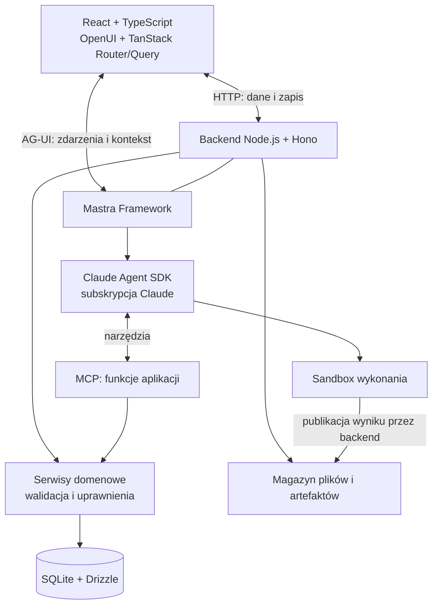

# Projekt techniczny aplikacji agentowej full stack

## Cel i zakres systemu

System jest lokalną aplikacją webową, w której interfejs, dane biznesowe i agent tworzą jeden produkt. Użytkownik pracuje przez komponenty interfejsu i rozmowę. Agent otrzymuje kontekst bieżącej pracy, wyszukuje dane, uruchamia funkcje backendu, modyfikuje kompozycję interfejsu oraz przetwarza pliki w izolowanym środowisku.

Projekt określa architekturę, technologie, kontrakty integracyjne i wymagania odbiorowe. Jest niezależny od domeny biznesowej. Nie definiuje encji produktu, struktury repozytorium, kolejności prac ani harmonogramu. Kryteria odbioru opisują wynik wdrożenia, a nie zadania wykonawcze.

Zakres obejmuje lokalny frontend i backend, trwałe dane, historię rozmów, artefakty, dynamiczny UI i wykonanie agenta. Claude działa jako usługa zewnętrzna rozliczana w ramach subskrypcji użytkownika. Praca offline, PWA, synchronizacja wielu urządzeń i infrastruktura publicznego SaaS pozostają poza zakresem.

## Architektura logiczna

AG-UI i MCP pełnią odrębne role. AG-UI przenosi zdarzenia pomiędzy aplikacją a wykonaniem agenta. MCP udostępnia agentowi narzędzia backendu. OpenUI Lang opisuje kompozycję komponentów renderowanych przez React. Żaden z tych mechanizmów nie zastępuje modelu domeny ani trwałego magazynu danych.

## Dobór technologii

| Obszar | Technologia | Uzasadnienie |
|---|---|---|
| Frontend | React i TypeScript, najnowsze stabilne wydania | Typowane komponenty i bezpośrednia zgodność z ekosystemem OpenUI. |
| Budowanie frontendu | Vite | Obsługuje aplikację React działającą po stronie klienta, z osobnym backendem i strumieniowaniem. |
| Nawigacja | TanStack Router | Typowane adresy, parametry i odtwarzanie kontekstu nawigacji. Router wskazuje przestrzeń pracy lub zasób; nie narzuca stałego wnętrza widoku. |
| Dane na froncie | TanStack Query | Współdzielenie pobrań, cache, odświeżanie oraz reakcje na mutacje. |
| Wygląd | Tailwind CSS i komponenty OpenUI | Wspólny styl komponentów produktu oraz wykorzystanie gotowego interfejsu rozmowy. |
| Dynamiczne UI | OpenUI Lang + Renderer | Kompozycja z kontrolowanego katalogu React. |
| Czat | OpenUI Agent Interface | Gotowa obsługa prezentacji rozmów i artefaktów, uruchamiana z własnym backendem. |
| Backend | Node.js LTS, TypeScript, Hono | Jeden język kontraktów i natywna integracja Mastry przez adapter Hono. Długotrwały proces odpowiedni dla sesji SDK i strumieni. |
| Orkiestracja | Mastra Framework | Wspólna obsługa agentów, workflowów, integracji i diagnostyki. |
| Harness | Claude Agent SDK + adapter `@mastra/claude` | Rzeczywista pętla wykonania Claude, sesje, narzędzia i kontrola uprawnień. |
| Dostęp do funkcji | MCP | Typowany i opisany interfejs narzędzi nad serwisami domenowymi. |
| Walidacja kontraktów | Zod | Walidacja danych w runtime i współdzielenie typów TypeScript. |
| Dane trwałe | SQLite + Drizzle ORM | Lokalna relacyjna baza bez osobnego serwera, z transakcjami i migracjami. |
| Pliki | Lokalny magazyn zarządzany przez backend | Trwałe artefakty niezależne od sesji modelu i katalogów tymczasowych. |
| Izolacja | Sandbox Claude SDK; izolacja procesu, gdy wymaga tego środowisko | Ograniczony dostęp do systemu plików i sieci podczas wykonywania kodu. |
| Weryfikacja | Vitest i Playwright | Testy kontraktów i logiki oraz odbiór zachowania w przeglądarce. |
| Telemetria | Mastra i Claude SDK; opcjonalnie Langfuse | Diagnostyka lokalna z możliwością zewnętrznej analizy. |

Backend jest projektowany w TypeScript. Python może służyć do przetwarzania plików wewnątrz sandboxu, ale nie jest drugim obowiązkowym backendem. Vite i Hono odpowiadają wymaganiom lokalnej aplikacji z osobnym serwerem; Next.js nie wnosi tu wymaganej funkcji renderowania serwerowego lub SEO, która uzasadniałaby dodatkową warstwę.

Wersje React i TypeScript mają być najnowszymi stabilnymi wydaniami dostępnymi podczas wdrożenia. Pozostałe pakiety muszą być z nimi zgodne; dokładne wersje utrwala lockfile. Niezgodność zależności jest jawnym problemem integracji, a nie powodem do cichego obniżenia wersji wymaganych technologii. Runtime Node.js pochodzi z aktywnej linii LTS. Nie są wymagane wydania canary ani eksperymentalne.

## Model własności danych

| Rodzaj informacji | Autorytet | Pozostałe reprezentacje |
|---|---|---|
| Dane biznesowe | Serwisy domenowe i baza backendu | Cache klienta i wyniki narzędzi są odczytami/projekcjami. |
| Kompozycja UI | Zapis kompozycji w backendzie | Renderer interpretuje zapis, a agent proponuje jego zmianę. |
| Stan roboczy formularza | Bieżąca interakcja użytkownika, z ustaloną polityką zachowania szkicu | Nie jest zatwierdzoną mutacją danych biznesowych. |
| Rozmowa aplikacji | Backend: właściciel, tytuł, wiadomości/prezentacja, powiązania | OpenUI korzysta z adaptera storage. |
| Sesja wykonania | Claude SDK, z trwałym zapisem i mapowaniem w backendzie | Historia UI nie jest drugą niezależnie edytowaną pamięcią modelu. |
| Artefakt | Backend: metadane, wersje i treść/pliki | Podgląd i pełny widok wskazują ten sam artefakt. |
| Stan zadania | Backend: rejestr wykonania | Czat i telemetryka prezentują stan, ale go nie zastępują. |

Jedno źródło prawdy oznacza jednego właściciela danego rodzaju informacji, a nie wymóg zapisywania wszystkiego w jednej tabeli. Kopie w cache i snapshoty raportów są dopuszczalne, jeżeli ich znaczenie i zasady aktualizacji są jawne.

## Przepływy funkcjonalne

**Odczyt danych:** komponent lub agent wywołuje funkcję backendu. Backend sprawdza zakres dostępu i pobiera dane. Agent może wyszukiwać i przechodzić po relacjach bez umieszczania całej bazy w kontekście modelu.

**Zmiana danych:** interfejs lub narzędzie MCP wywołuje ten sam serwis domenowy. Serwis waliduje wejście, dostęp i aktualność rekordu, wykonuje transakcję oraz zwraca wynik i informację o zmienionych zasobach. Frontend odświeża odpowiadające im zapytania. Powtórzone żądanie nie powiela operacji biznesowej.

**Zmiana interfejsu:** agent tworzy lub modyfikuje kompozycję z katalogu OpenUI. Aplikacja sprawdza schemat, dozwolone komponenty i odwołania do danych. Renderer pokazuje zaakceptowaną kompozycję, zachowując istotny stan interakcji.

**Przetworzenie pliku:** backend przyjmuje plik, udostępnia go w workspace wykonania i uruchamia agenta w sandboxie. Wynik jest rejestrowany jako artefakt, zapisywany trwale i dostępny do pobrania z aplikacji.

**Kontynuacja rozmowy:** backend odtwarza prezentację rozmowy i powiązaną sesję Claude. Wznowienie nie dokleja ponownie już zapisanych wiadomości i nie odtwarza skutków zakończonych mutacji.

## Warstwy systemu i warunki odbioru

Warstwa jest zamknięta, gdy wszystkie jej kryteria są spełnione i mają dowód z działającego systemu lub właściwego testu kontraktu. Punkt zablokowany, pominięty lub potwierdzony wyłącznie dokumentacją pozostawia warstwę otwartą. Kryteria warunkowe odnoszą się tylko do jawnie opisanej funkcji opcjonalnej. Zamknięcie wszystkich warstw wymaga dodatkowo potwierdzenia przepływów między nimi.

### 1. Runtime i środowisko full stack

**Cel:** uruchamialna lokalna aplikacja z trwałym backendem. **Technologie:** Node.js LTS, Hono, Vite, React, TypeScript.

- [ ] Frontend i backend uruchamiają się z udokumentowanej konfiguracji na docelowym systemie.
- [ ] React i TypeScript są najnowszymi stabilnymi wersjami; lockfile i zgodność zależności są sprawdzone.
- [ ] Build produkcyjny oraz sprawdzanie typów kończą się bez błędów; działanie nie zależy od serwera developerskiego Vite.
- [ ] Backend obsługuje zwykłe żądania i strumienie bez buforowania odpowiedzi do końca generacji.
- [ ] Konfiguracja prywatna nie trafia do pakietu frontendu ani odpowiedzi HTTP.
- [ ] Restart zachowuje trwałe dane; zatrzymanie aplikacji nie pozostawia niezarządzanych procesów roboczych.
- [ ] Dostęp lokalny ma jawne zasady origin i autoryzacji; token subskrypcji nie pełni roli tokena dostępu do aplikacji.

Źródła: [Vite](https://vite.dev/guide/), [adapter Hono dla Mastry](https://mastra.ai/reference/server/hono-adapter), [Node.js LTS](https://github.com/nodejs/Release), [React](https://react.dev/versions), [TypeScript](https://www.typescriptlang.org/download/).

### 2. Komponenty i nawigacja frontendowa

**Cel:** spójny i dostępny interfejs z elementów wielokrotnego użytku. **Technologie:** React, TypeScript, TanStack Router, Tailwind CSS.

- [ ] Komponenty domenowe mają typowane właściwości i są zarejestrowane w katalogu OpenUI.
- [ ] Domyślna kompozycja obejmuje lewą nawigację i prawy czat, z adaptacją do mniejszych ekranów.
- [ ] Nawigacja, odświeżenie oraz Wstecz/Dalej przywracają właściwą rozmowę lub przestrzeń pracy.
- [ ] Dynamiczne wnętrze UI nie wymaga generowania nowych plików tras ani wykonywalnego kodu aplikacji.
- [ ] Formularze i podstawowe interakcje działają z klawiatury, mają etykiety i widoczny fokus.
- [ ] Ładowanie, brak danych, błąd i brak dostępu mają rozróżnialne stany prezentacji.

Źródła: [TanStack Router](https://tanstack.com/router/latest), [Tailwind z Vite](https://tailwindcss.com/docs/installation/using-vite), [katalog OpenUI](https://www.openui.com/docs/openui-lang/defining-components).

### 3. Dynamiczna kompozycja interfejsu

**Cel:** pełna robocza kompozycja UI modyfikowana przez agenta w kontrolowanych granicach. **Technologie:** OpenUI Lang i Renderer.

- [ ] Początkowy układ i układ zmieniony przez agenta korzystają z tego samego katalogu komponentów.
- [ ] Agent może dodać, usunąć, przestawić i zmienić właściwości elementu przez obsługiwany opis kompozycji.
- [ ] Nieznany komponent, nieprawidłowe właściwości i niedozwolone odwołania nie są wykonywane ani zatwierdzane.
- [ ] Częściowa lub błędna odpowiedź modelu nie niszczy ostatniego poprawnego układu.
- [ ] Zmiana kompozycji zachowuje zaznaczenia, filtry i niezapisane dane albo jawnie rozwiązuje konflikt przed ich utratą.
- [ ] Zapisana kompozycja jest odtwarzana po ponownym otwarciu aplikacji.
- [ ] Dane biznesowe wyświetlane przez komponenty pochodzą z backendu; wygenerowane wartości nie zastępują trwałych rekordów.

Źródła: [komponenty](https://www.openui.com/docs/openui-lang/defining-components), [edycja przyrostowa](https://www.openui.com/docs/openui-lang/incremental-editing), [zapytania i mutacje](https://www.openui.com/docs/openui-lang/queries-mutations).

### 4. Czat i zarządzanie rozmowami

**Cel:** gotowy interfejs rozmów bez implementowania kolejnego własnego chatbota. **Technologie:** OpenUI Agent Interface, adapter storage backendu.

- [ ] Czat korzysta z gotowego komponentu OpenUI, bez obowiązkowej zewnętrznej płatnej usługi.
- [ ] Użytkownik tworzy rozmowę, widzi ją na liście, przełącza się między rozmowami i usuwa wybraną rozmowę.
- [ ] Rozmowy mają automatyczne sensowne tytuły oraz możliwość zmiany tytułu; mechanizm nie korzysta z API Anthropic.
- [ ] Historia i tytuły wracają po odświeżeniu oraz restarcie backendu.
- [ ] Przełączenie rozmowy nie miesza wiadomości, kontekstu ani wyników trwających wykonań.
- [ ] Powtórzenie żądania lub reconnect nie tworzy podwójnych wiadomości.
- [ ] Usunięcie ma określony skutek dla sesji, aktywnego zadania i artefaktów; aplikacja nie pozostawia niespójnych powiązań.
- [ ] Zakres gotowej obsługi edycji wiadomości, rozgałęziania i przywracania usuniętych rozmów jest opisany jako dostępny lub niedostępny; UI nie sugeruje niezaimplementowanych funkcji.

Źródło: [OpenUI — backend i storage](https://www.openui.com/docs/agent/reference/self-hosting).

### 5. Komunikacja i zdarzenia

**Cel:** pełna informacja o wykonaniu w UI. **Technologie:** AG-UI, integracja Mastry, adapter strumienia OpenUI.

- [ ] Tekst jest widoczny przyrostowo przed zakończeniem generacji.
- [ ] UI rozpoznaje rozpoczęcie i zakończenie wykonania, błąd oraz anulowanie.
- [ ] Wywołania narzędzi i ich wyniki są powiązane i dostępne dla prezentacji w czacie.
- [ ] Dane artefaktów i zmian UI docierają do właściwych rendererów.
- [ ] Pytanie lub prośba o decyzję dociera do interfejsu, a odpowiedź wraca do właściwego wykonania.
- [ ] Rozłączenie i ponowne połączenie nie powielają zdarzeń ani skutków operacji.
- [ ] Każde wykonanie ma jeden rozstrzygający status końcowy; UI nie pozostaje bezterminowo w stanie ładowania po błędzie.
- [ ] Pokrycie zdarzeń zostało sprawdzone z rzeczywistym adapterem Claude, a brakujące mapowania są jawnie opisane.

Źródła: [Mastra–AG-UI](https://github.com/ag-ui-protocol/ag-ui/tree/main/integrations/mastra/typescript), [OpenUI–Mastra](https://www.openui.com/integrations/mastra).

### 6. Kontekst aplikacji dla agenta

**Cel:** trafne działanie na aktualnie oglądanych danych bez przesyłania całej bazy. **Technologie:** kontrakt kontekstu, Zod, AG-UI i narzędzia odczytu.

- [ ] Kontekst obejmuje aktualną rozmowę, zasób, zaznaczenie, filtry i identyfikację kompozycji.
- [ ] Zmiana wyboru w UI zmienia kontekst kolejnego polecenia.
- [ ] Agent potrafi pobrać aktualny kontekst podczas dłuższego zadania.
- [ ] Kontekst przesłany przez frontend jest walidowany i nie nadaje uprawnień backendowych.
- [ ] Agent odróżnia roboczy stan formularza od danych zapisanych.
- [ ] Polecenie odnoszące się do aktualnego elementu prowadzi do operacji na właściwym rekordzie, co potwierdza wynik backendu.
- [ ] Większe zbiory są pobierane selektywnie z paginacją lub limitem, a nie dołączane w całości do każdego promptu.

Źródła: [Zod](https://zod.dev/), [AG-UI](https://docs.ag-ui.com/).

### 7. Orkiestracja backendowa

**Cel:** wspólne wykonanie agentowe i integracje bez tworzenia własnego silnika od początku. **Technologie:** Mastra Framework, adapter Hono.

- [ ] Claude SDK jest zarejestrowany i wywoływany przez oficjalną integrację Mastry.
- [ ] Żądanie aplikacji jest powiązane z wykonaniem, kontekstem i diagnostyką.
- [ ] Wynik, błąd i anulowanie przechodzą przez warstwę orkiestracji do klienta.
- [ ] Równoległe żądania do tej samej sesji nie powodują niekontrolowanych wyścigów ani mieszania kontekstów.
- [ ] Orkiestracja nie omija serwisów domenowych przy mutacjach.
- [ ] Zakres własnych adapterów i wykorzystanych mechanizmów Mastry jest udokumentowany.
- [ ] Działanie nie wymaga Mastra Factory, dodatkowego harnessu AgentController ani hostingu Mastry.

Źródła: [SDK agents](https://mastra.ai/docs/connections/sdk-agents), [Hono](https://mastra.ai/reference/server/hono-adapter).

### 8. Harness i uwierzytelnienie Claude

**Cel:** rzeczywisty runtime Claude używający wyłącznie subskrypcji. **Technologie:** Claude Agent SDK, `@mastra/claude`.

- [ ] Wykonanie korzysta z pętli i narzędzi Claude SDK, a nie wyłącznie modelu Claude w routerze LLM.
- [ ] Działa uwierzytelnienie subskrypcyjne, z potwierdzeniem trybu bez ujawniania tokena.
- [ ] Klucz API Anthropic, gateway i automatyczny fallback płatnego API nie są aktywną ścieżką wykonania.
- [ ] Narzędzia MCP są dostępne w SDK i prawdziwe wywołanie zwraca wynik do dalszej pracy agenta.
- [ ] Sesja jest kontynuowana przez jej właściwy identyfikator, bez powielania historii.
- [ ] Wygaśnięcie uwierzytelnienia i wyczerpanie limitu dają czytelny błąd oraz zachowują stan pracy.
- [ ] Poświadczenia pozostają poza frontendem, artefaktami i logami.
- [ ] Zgodność konkretnej wersji SDK, adaptera i sposobu logowania została sprawdzona rzeczywistym wywołaniem.

Ścieżkę techniczną uzasadnia przekazywanie opcji SDK przez adapter oraz oficjalny mechanizm tokena subskrypcyjnego Claude. Potwierdzenie dokumentacyjne nie jest jeszcze odbiorem wdrożenia. MiniMax przez klucz API pozostaje osobnym opcjonalnym wariantem; jego działanie nie zalicza tej warstwy.

Źródła: [adapter Claude](https://github.com/mastra-ai/mastra/blob/main/agent-sdks/claude/src/index.ts), [uwierzytelnienie](https://code.claude.com/docs/en/authentication), [subskrypcja i SDK](https://support.claude.com/en/articles/15036540-use-the-claude-agent-sdk-with-your-claude-plan).

### 9. Model domeny i funkcje backendu

**Cel:** jeden autorytet danych i bezpieczne operacje biznesowe. **Technologie:** serwisy TypeScript, Zod, MCP, Drizzle i SQLite.

- [ ] Encje, relacje i reguły domenowe są opisane dla konkretnego produktu.
- [ ] Endpointy i narzędzia MCP korzystają z tych samych reguł walidacji i mutacji.
- [ ] Wejścia są walidowane w runtime, a błędy mają rozpoznawalne typy i przyczyny.
- [ ] Agent potrafi wyszukać rekord, przejść po wielopoziomowych relacjach i pobrać szczegóły.
- [ ] Uprawnienia sprawdza backend; identyfikator właściciela dostarczony przez model lub przeglądarkę nie wystarcza do uzyskania dostępu.
- [ ] Konflikt aktualności nie nadpisuje nowszych danych bez rozstrzygnięcia.
- [ ] Powtórzenie tej samej operacji nie dubluje skutków biznesowych.
- [ ] Operacja wieloetapowego zapisu jest atomowa albo ma jawny mechanizm odzyskania spójności.
- [ ] Testy potwierdzają rzeczywistą zmianę danych oraz odrzucenie nieuprawnionej operacji.

Źródła: [MCP w Claude SDK](https://code.claude.com/docs/en/agent-sdk/mcp), [Zod](https://zod.dev/), [Drizzle i SQLite](https://orm.drizzle.team/docs/sqlite/get-started-sqlite).

### 10. Trwałość, cache i artefakty

**Cel:** odtwarzalna praca i aktualny interfejs. **Technologie:** SQLite, Drizzle, TanStack Query, storage i renderery OpenUI, trwałe sesje SDK.

- [ ] Własność każdego rodzaju danych odpowiada tabeli modelu własności; nie istnieją niezależnie mutowane kopie domeny.
- [ ] Migracje tworzą i aktualizują bazę bez utraty obsługiwanych danych; sprawdzona jest kopia i odtworzenie trwałego stanu lokalnego.
- [ ] Rozmowa aplikacji jest jednoznacznie powiązana z sesją Claude i jej właścicielem.
- [ ] Restart przywraca historię, kompozycję, powiązania sesji i artefakty.
- [ ] Mutacja przez UI lub MCP odświeża właściwe dane na froncie bez pełnego przeładowania.
- [ ] Komponenty współdzielą pobrania dla tego samego zasobu; klucze cache uwzględniają kontekst dostępu i filtry.
- [ ] Zmiana kontekstu właściciela nie ujawnia danych z poprzedniego cache.
- [ ] Artefakt ma stabilny identyfikator, wersję, właściciela i trwałą treść; tytuł nie jest jego kluczem.
- [ ] Podgląd i pełny widok wskazują tę samą wersję; pliki można pobrać po restarcie.
- [ ] Raport historyczny zachowuje treść, a artefakt oznaczony jako żywy pobiera aktualne dane.

Adapter Claude nie zapewnia automatycznie pamięci Mastry. Zapis rozmów i mapowanie sesji wymagają jawnego rozwiązania; samo podłączenie storage do czatu nie potwierdza poprawnego wznowienia modelu.

Źródła: [sesje SDK](https://code.claude.com/docs/en/agent-sdk/sessions), [storage OpenUI](https://www.openui.com/docs/agent/reference/self-hosting), [artefakty](https://www.openui.com/docs/agent/core-concepts/artifacts), [renderery](https://www.openui.com/docs/agent/guides/custom-artifacts), [TanStack Query](https://tanstack.com/query/latest/docs/framework/react/guides/query-invalidation).

### 11. Pliki, sandbox i cykl życia zadań

**Cel:** rzeczywiste przetwarzanie plików i kontrolowane długie wykonanie. **Technologie:** sandbox Claude SDK, workspace, backendowy rejestr zadań i magazyn plików.

- [ ] Użytkownik wgrywa plik, agent odczytuje go i przetwarza kodem, a użytkownik pobiera poprawny wynik.
- [ ] Limity wielkości, nazwy plików i zakres katalogów są egzekwowane przez backend.
- [ ] Izolacja jest aktywna na docelowym systemie; kontrolowane próby niedozwolonego odczytu, zapisu i dostępu do sieci są odrzucane.
- [ ] Sandbox poleceń i uprawnienia narzędzi plikowych obejmują wszystkie udostępnione sposoby dostępu, a nie tylko powłokę.
- [ ] Narzędzia nie mają niejawnego dostępu do bazy domenowej pozwalającego ominąć MCP i serwisy backendu.
- [ ] Zadanie ma trwały status i powiązanie z rozmową; zamknięcie panelu nie usuwa informacji o pracy.
- [ ] Stop dociera do wykonania i jego procesów potomnych; pomiar czasu anulowania znajduje się w odbiorze.
- [ ] Restart rozróżnia zadanie zakończone od przerwanego; wznowienie nie udaje kontynuacji utraconego procesu.
- [ ] Wymagane pytania i zgody pojawiają się w aplikacji; odmowa nie wykonuje operacji, zgoda nie wykonuje jej podwójnie.
- [ ] Opublikowane wyniki pozostają trwałe po sprzątnięciu plików tymczasowych.

Źródła: [sandbox i opcje SDK](https://code.claude.com/docs/en/agent-sdk/typescript), [izolacja procesu](https://code.claude.com/docs/en/agent-sdk/secure-deployment), [uprawnienia](https://code.claude.com/docs/en/agent-sdk/permissions).

### 12. Obserwowalność i odbiór integracji

**Cel:** możliwość ustalenia przebiegu, wyniku i ograniczeń działania. **Technologie:** diagnostyka Mastry i SDK, Vitest, Playwright; Langfuse opcjonalnie.

- [ ] Rozmowę można powiązać z wykonaniem, narzędziem, mutacją i artefaktem w danych diagnostycznych.
- [ ] Błędy integracji, domeny, modelu i sandboxu są rozróżnialne; sekrety nie występują w logach.
- [ ] Zmierzone są czas pierwszej odpowiedzi, wykonania, odświeżenia po mutacji i anulowania, z podaniem warunków pomiaru.
- [ ] Testy kontraktów obejmują walidację, konflikty, powtórzenia i kontrolę dostępu.
- [ ] Testy przeglądarkowe obejmują dynamiczny UI, rozmowy, narzędzia, artefakty i wznowienie.
- [ ] Rzeczywista ścieżka subskrypcja Claude → SDK → Mastra → AG-UI → OpenUI została potwierdzona; mocki są oznaczone osobno.
- [ ] Opis odbioru wskazuje wersje, dowody, nieudane próby, brakujące możliwości i własne adaptery.
- [ ] System działa bez Langfuse; możliwość eksportu i ewentualne ograniczenia kompatybilności są udokumentowane.

Źródła: [Mastra SDK agents](https://mastra.ai/docs/connections/sdk-agents), [Langfuse i Mastra](https://langfuse.com/integrations/frameworks/mastra), [Vitest](https://vitest.dev/guide/), [Playwright](https://playwright.dev/docs/intro).

## Odbiór całego systemu

Zamknięcie warstw musi odpowiadać działaniu produktu jako całości. Odbiór obejmuje powiązane odczyt i mutację danych przez MCP, odświeżenie UI, zmianę kompozycji, przetworzenie pliku, zapis artefaktu i kontynuację rozmowy po restarcie. Konieczne jest też sprawdzenie błędu, odmowy dostępu, anulowania i konfliktu danych.

Raport odbioru rozróżnia funkcje dostarczone przez biblioteki, konfigurację, własne adaptery i logikę domenową. Dla każdego kryterium podaje wynik oraz dowód lub ograniczenie. Niepowodzenie albo brak testu nie są zaliczeniem. Warstwy opisują docelową architekturę, a ich istnienie w dokumentacji dostawców nie poświadcza jeszcze działania pełnego systemu.

## Ryzyka i granice projektu

- Zgodność Mastra–AG-UI–OpenUI z Claude SDK wymaga weryfikacji całego zestawu zdarzeń, nie tylko tekstu.
- Sesje Claude i historia aplikacji mają odrębne mechanizmy trwałości; ich mapowanie jest elementem integracji.
- Subskrypcja i zasady uwierzytelnienia są zależnością zewnętrzną. Brak dostępu nie powoduje automatycznego przejścia na API Anthropic.
- Sandbox ma ograniczenia platformowe; katalog pracy i lista narzędzi nie stanowią samodzielnie izolacji procesu.
- Najnowsze wersje React i TypeScript mogą ujawnić niezgodności zależności. Takie ograniczenia muszą być jawne w odbiorze.
- Projekt nie deklaruje kompletnego zestawu gotowych adapterów. Zakres własnej integracji jest wynikiem wdrożenia i weryfikacji.
- Specyfikacja dotyczy lokalnej aplikacji. Publiczny dostęp wieloużytkownikowy, SSO, skalowanie i wysoka dostępność wymagają rozszerzenia projektu.
